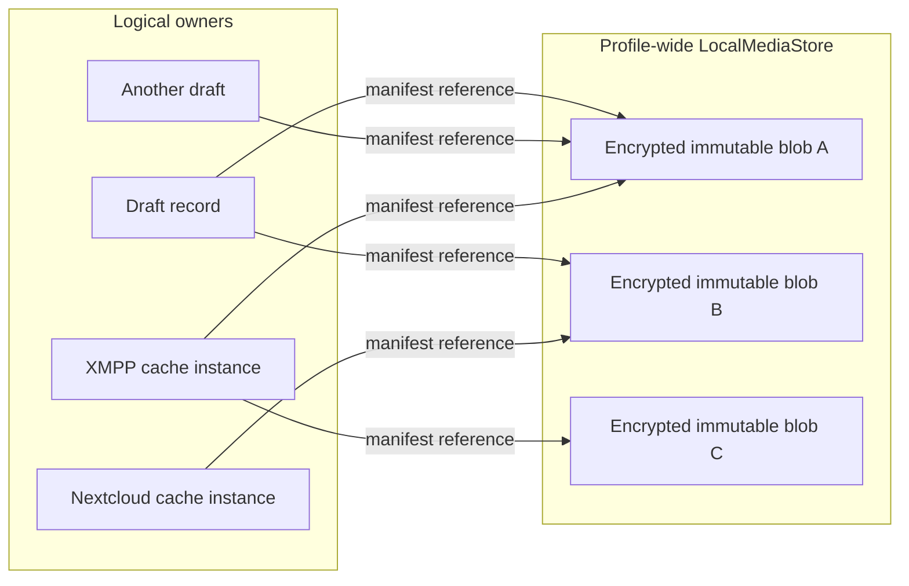
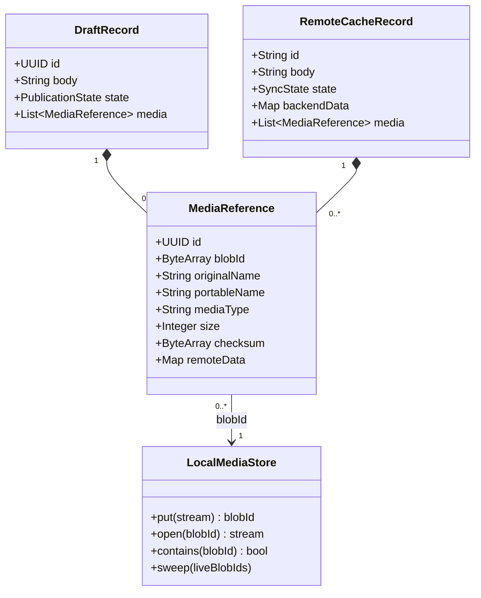
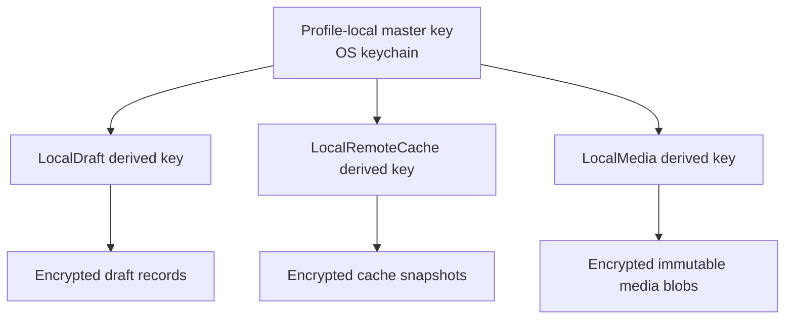
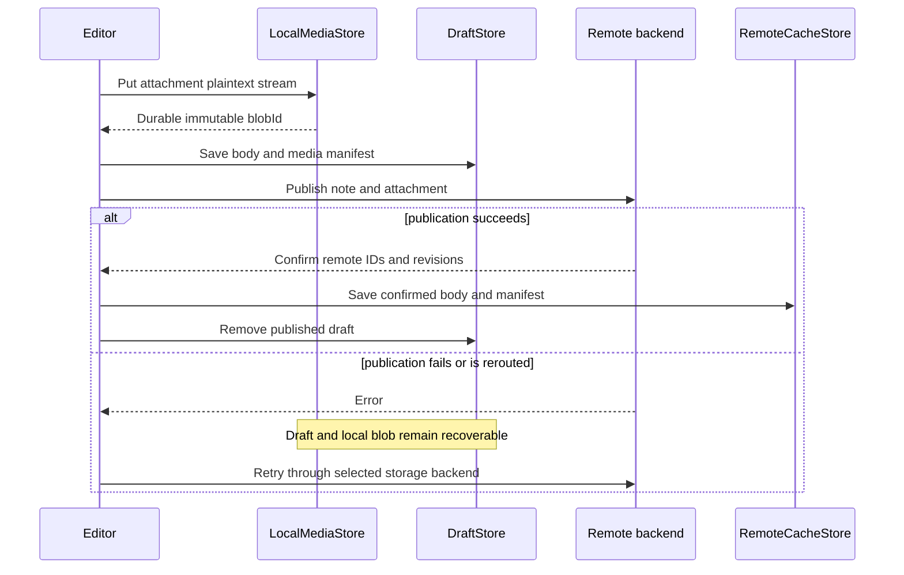
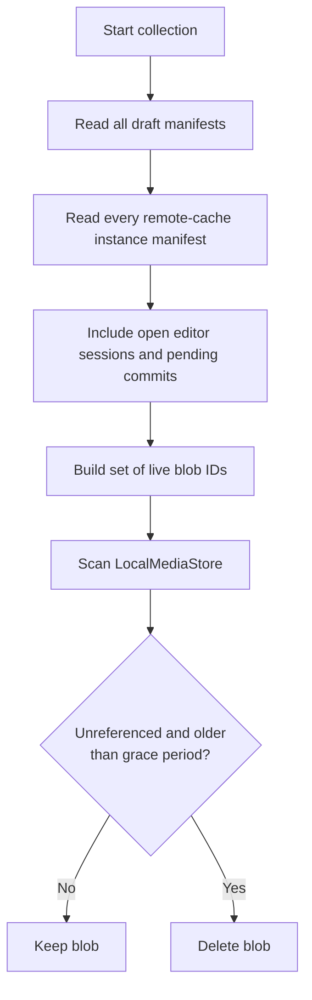
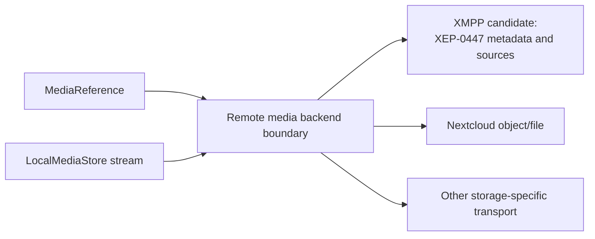
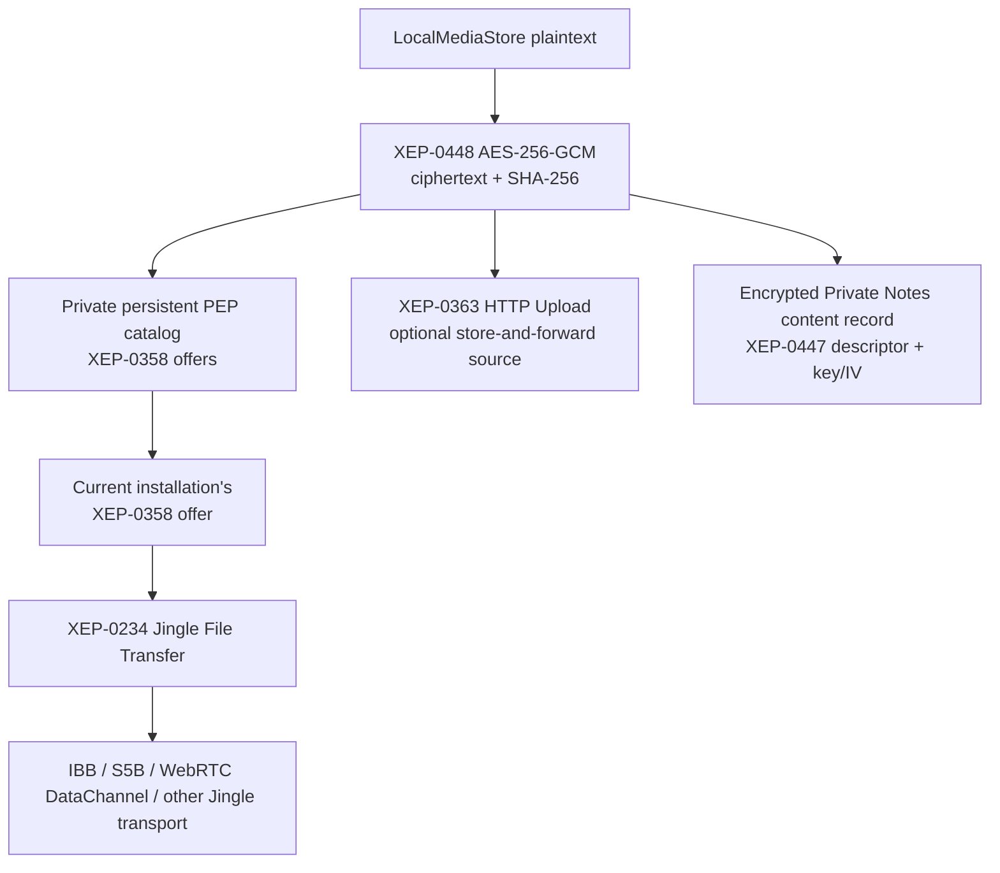

# Media storage architecture

Status: partially implemented. The shared encrypted local blob store, draft/cache
manifests, `anykeep-media:` references, image/audio insertion and playback, PTF
sidecars, and the Iris/XMPP remote-media transport are in place. Tomboy/Gnote
adapters and fully streaming local-at-rest blob I/O remain future work.

AnyKeep notes are Markdown documents. Attachments and inline media are addressed
from Markdown by a stable attachment UUID and a readable portable filename:

```markdown
[Project budget.xlsx](anykeep-media:/7f28c5de-5f48-4d44-918f-b24d5b672f30/project-budget.xlsx)

<audio controls src="anykeep-media:/9b82323d-6aa4-43d1-b547-acde11bd37fe/Audio_20260801_211300.m4a" title="Audio recording" data-anykeep-duration-ms="42000"></audio>
```

The UUID is authoritative. The final URI component is only a readable fallback
for raw Markdown, recovery, and export. Link text, image alt text, and the audio
`title` attribute are user-visible descriptions. The attachment manifest retains
the original filename. Audio duration is structural editor metadata; the player
also accepts the duration reported by the decoder at runtime.

## Design goals

- render useful Markdown both in rendered and raw-source modes;
- keep drafts and remote caches encrypted at rest;
- avoid copying large attachments when a note moves between a cache and a draft;
- support rerouting a failed publication to another storage;
- preserve original filenames without using unsafe names on disk;
- deduplicate immutable local content;
- keep storage-specific transports behind backend interfaces;
- support multiple configured storage instances per plugin.

## Hybrid storage model

AnyKeep uses logically separate draft and remote-cache records, but they refer to
one profile-wide immutable media store. Each record owns its manifest; the shared
store owns only encrypted bytes.



This is hybrid rather than fully global storage: physical bytes are shared, while
ownership, synchronization state, original names, and remote metadata remain in
the draft or cache record that uses them.

An attachment blob is immutable. Editing an image or replacing a document creates
a new blob and updates the manifest. Existing notes and recoverable drafts continue
to reference the old content.

## Data model

The exact C++ API may evolve, but the persistent model should contain the following
information:

```cpp
struct MediaReference {
    QUuid id;                 // Attachment identity used by anykeep-media URIs.
    QByteArray blobId;        // Identity of immutable local content.
    QString originalName;     // Original display/export filename.
    QString portableName;     // Cross-platform fallback used in the URI.
    QString mediaType;        // Validated MIME type.
    qint64 size = 0;
    QByteArray checksum;      // Plaintext integrity metadata.
    QVariantMap remoteData;   // Backend-specific source/object metadata.
};
```

`DraftRecord` and `RemoteCacheRecord` each persist a list of `MediaReference`
objects. A media reference is not a filesystem path and does not contain encrypted
blob bytes.



## Blob identity and layout

The preferred blob identifier is a keyed content digest:

```text
blobId = HMAC-SHA-256(derived media-ID key, plaintext bytes)
```

It permits local deduplication without exposing a directly testable ordinary
content hash in filenames. The encrypted envelope still records and authenticates
the expected identifier, size, schema, and object kind.

A sharded physical layout avoids oversized directories:

```text
<AnyKeep data>/media/
  ab/
    cd/
      abcdef...blob
```

Blob files never use the original filename. Original and portable filenames are
encrypted manifest metadata.

## Encryption domains

Drafts, remote caches, and shared media use the same profile-local master key from
the operating-system keychain, but different derived encryption domains:



All three use the same authenticated-encryption implementation. Domain separation
prevents a cache record, draft record, and media blob from being substituted for
one another. Media has one shared domain because every manifest refers to the same
physical `LocalMediaStore` object.

## Editing, publication, and rerouting

The note-level state machine, multi-editor lease rules, publication retries, and
conflict handling are defined in
[Note lifecycle architecture](note-lifecycle-architecture.md).

Blob bytes are written before the new manifest is committed. A crash can therefore
leave an unreferenced blob, which is safe and can be collected later. A manifest
must never reference a blob that has not been durably committed.



Creating a draft from a cached note copies the body and manifest metadata, but not
the media bytes. Successful publication similarly installs references in the cache
without copying local blobs. Publishing to a remote service necessarily decrypts
the local blob stream and transforms or encrypts it for that service; this does not
modify the local blob.

## Garbage collection

Persistent reference counters are deliberately avoided because a crash between a
manifest update and a counter update could make them incorrect. Collection uses a
mark-and-sweep pass:



The grace period protects interrupted imports, publication rerouting, rollback, and
older cache snapshots. Collection must skip manifests it cannot authenticate or
read; unreadable ownership information must never be interpreted as an empty set.

## Filenames and export

`originalName` is preserved as metadata after Unicode validation and a length
limit. It is never trusted as a path. `portableName` is generated for the Markdown
URI and filesystem materialization by:

- removing control characters and path separators;
- replacing Windows-reserved characters;
- rejecting `.` and `..`;
- handling reserved device names such as `CON`, `PRN`, `AUX`, and `NUL`;
- removing trailing spaces and periods;
- bounding the encoded filename length while preserving the extension;
- resolving collisions with deterministic numeric suffixes.

PTF, Tomboy, and similar file-oriented stores may materialize attachments in a
sidecar directory named after the note. This is a storage adapter representation,
not AnyKeep's internal ownership model:

```text
note.ptf
note/
  project-budget.xlsx
  IMG_142315.png
```

The adapter converts `anykeep-media:` URIs to relative paths on export and performs
the inverse import into `LocalMediaStore` on load.

## Audio recording and playback

AnyKeep requests AAC-LC in an M4A/MP4 container, mono, 48 kHz, 64 kbit/s average
bit rate. The recorder is exposed only when the active Qt Multimedia backend can
resolve that codec/container pair; it does not silently fall back to a
platform-specific container.

Native encoders require a seekable output file. Recording therefore uses a
short-lived owner-only temporary directory, imports the finished encoded bytes
into `LocalMediaStore`, and removes the temporary plaintext file immediately
after import. Normal playback decrypts the immutable blob into a seekable
`QBuffer` and supplies it to `QMediaPlayer`; no persistent plaintext playback
copy is created.

Audio is a first-class structural block. Its `anykeep-media:` URI participates in
manifest pruning, undo/redo, internal copy/paste, cross-note attachment cloning,
and PTF sidecar import/export exactly like an image URI.

## Remote backend boundary

The local media model is independent of the remote transport. Each remote storage
adapter maps a `MediaReference` and local plaintext stream to its native object and
stores the resulting remote metadata in its own manifest.



### XMPP implementation

The Iris backend maps every XMPP attachment to
[XEP-0447: Stateless File Sharing](https://xmpp.org/extensions/xep-0447.html).
XEP-0446 metadata describes the plaintext file. The payload itself is encrypted
once with [XEP-0448](https://xmpp.org/extensions/xep-0448.html), using
AES-256-GCM, and every transport source serves those identical ciphertext
bytes.



HTTP Upload is optional. Durability comes from the private persistent catalog
of Jingle offers and from allowing every installation that has verified and
stored the ciphertext to become another provider. Each offer is a direct
XEP-0358 item identified by an opaque UUID and a stable full resource JID. On
save, an unchanged attachment reuses its XEP-0448 key/IV and existing HTTP URL,
if any, while publishing the current installation's offer for those exact
ciphertext bytes.

Serving requires more than the note's embedded descriptor. Before publishing,
the Iris backend persists an encrypted local capability containing the blob
identity, key, IV, cipher size, and cipher hash. After restart that capability
is unverified. Iris checks its exact PubSub item before allowing the factory to
serve; an early XEP-0358 `<start/>` waits for this synchronization. A remote
retract or confirmed absence disables the capability without resurrecting the
item from disk.

The XEP-0448 key, IV, ciphertext hash, optional URL, and embedded Jingle
reference are stored inside the already authenticated and encrypted Private
Notes content record. Consequently an untrusted HTTP server, IBB/S5B proxy path, or other
transport sees only ciphertext. WebRTC/DTLS may provide transport security as
well, but AnyKeep does not depend on that for attachment E2E confidentiality.
This is why the attachment layer does not use `EncryptionController::DataStream`
or XEP-0391/JET in the current profile: doing so would create a second,
transport-specific encryption identity and would not cover every source with
the same bytes.

On receive, AnyKeep tries the embedded offer and then every catalog offer from
the same bare JID whose ciphertext size and SHA-256 match. Failed negotiation,
transfer, or integrity validation advances to the next provider; an HTTP URL,
when present, is the final fallback. Before installing an attachment locally it
verifies ciphertext SHA-256, authenticates XEP-0448 decryption, and verifies the
plaintext size and SHA-256 from XEP-0446 metadata. A successful downloader
persists and publishes its own serving capability, so the original provider
does not remain a single point of availability.
The first implementation hydrates all attachments when a specific note is explicitly opened;
background index/body warming does not download media. Lazy hydration of large arbitrary
attachments can be added later together with a remote-only media-reference state.

The Private Notes attachment UUID is stable and independent of source lifetime.
It is both the XEP-0447 `file-sharing` ID and the identity used by
`anykeep-media:` Markdown URIs. Changing a Jingle publication or HTTP source
therefore does not rewrite the note body.

Network encryption is streamed through Iris `QIODevice` adapters. The current
`LocalMediaStore`, however, still decrypts its at-rest SecureEnvelope into a
`QByteArray`; eliminating that remaining plaintext-in-memory copy requires a
separate streaming format for the local encrypted blob store rather than a
Jingle or XEP-0448 change.

## Failure and security rules

- Validate declared size, MIME type, decoded dimensions, and integrity digest.
- Enforce configurable per-file and aggregate limits before allocation or decode.
- Stream large files; do not require a complete plaintext copy in memory.
- Treat SVG, HTML, PDF, and active document formats as untrusted input.
- Never resolve attachment names as relative or absolute input paths.
- Do not automatically open downloaded attachments in external applications.
- Authenticate the encrypted envelope before exposing any plaintext.
- Keep the draft until both note and required attachment publication are confirmed.
- Do not delete remote media merely because one local reference disappeared; the
  remote backend must apply its revision and ownership rules.

## Implementation stages

1. Add `MediaReference`, URI parsing, filename normalization, and Markdown
   rendering hooks.
2. Implement encrypted immutable `LocalMediaStore` and its tests.
3. Add media manifests to draft and remote-cache payload versions.
4. Implement insertion, preview, export, and safe external opening.
5. Add mark-and-sweep collection with a grace period.
6. Implement PTF/Tomboy sidecar adapters.
7. Implement the XMPP mapping with XEP-0447/XEP-0448, XEP-0363, and XEP-0358/Jingle.
8. Make the local encrypted media store itself streaming for very large files.
9. Define transports independently for other remote-storage plugins.
