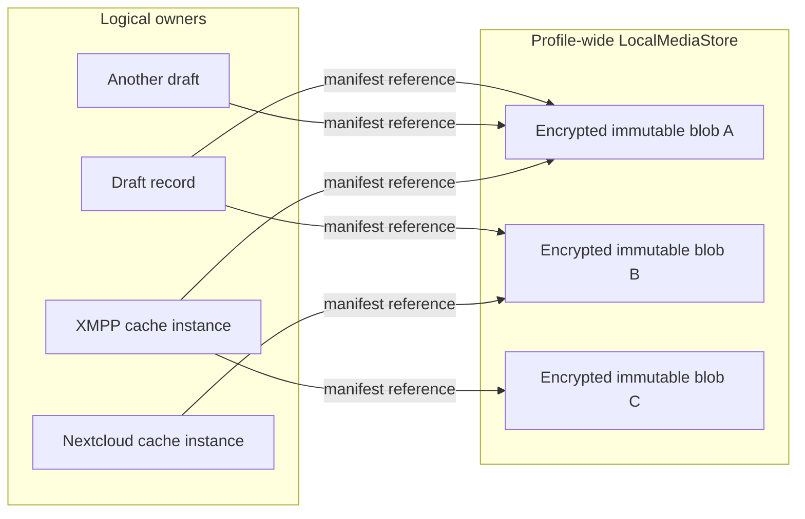
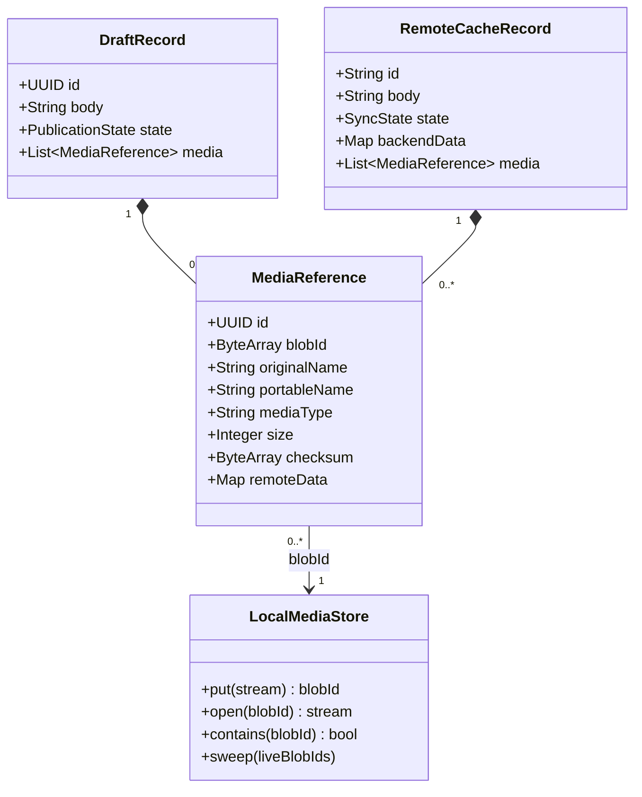
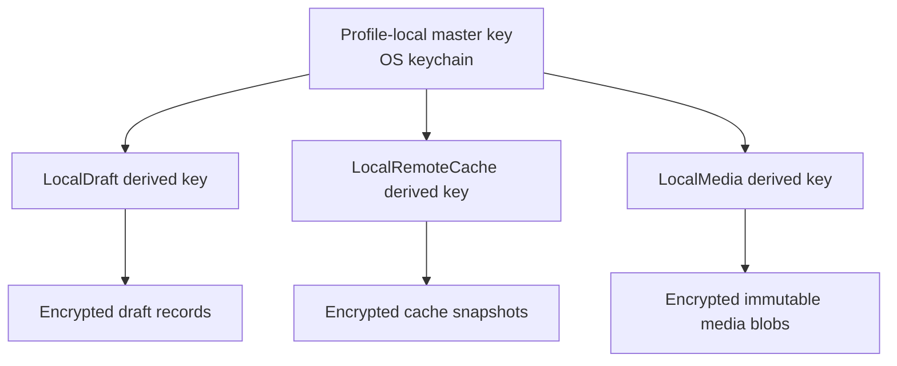
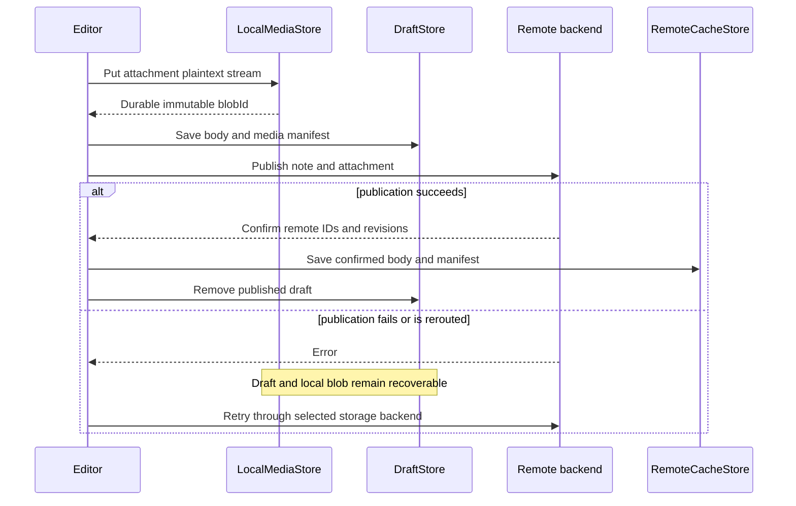
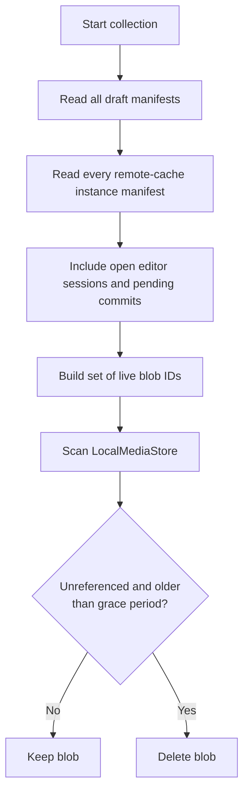
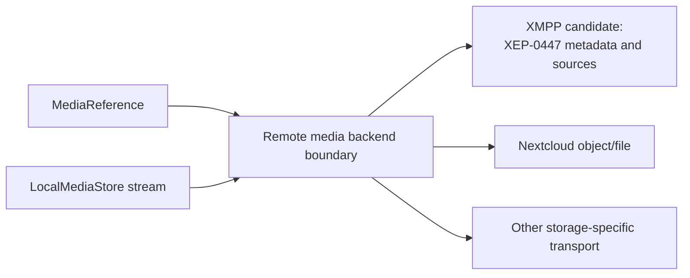
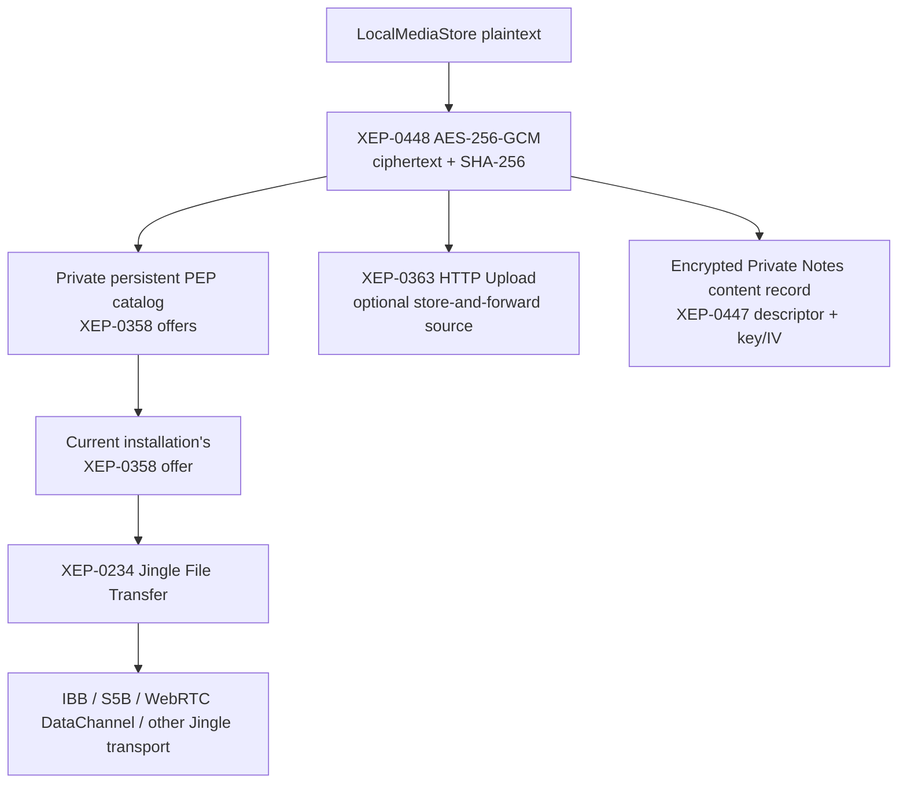

# Media storage architecture

Status: partially implemented. The shared encrypted local blob store, draft/cache
manifests, `anykeep-media:` references, image/audio insertion and playback, PTF
sidecars, and the Iris/XMPP remote-media transport are in place. Tomboy/Gnote
adapters and fully streaming local-at-rest blob I/O remain future work.

AnyKeep notes are Markdown documents. Attachments and inline media are addressed
from Markdown by a stable attachment UUID and a readable portable filename:

```markdown
[Project budget.xlsx](anykeep-media:/7f28c5de-5f48-4d44-918f-b24d5b672f30/project-budget.xlsx)

<audio controls src="anykeep-media:/9b82323d-6aa4-43d1-b547-acde11bd37fe/Audio_20260801_211300.m4a" title="Audio recording" data-anykeep-duration-ms="42000"></audio>
```

The UUID is authoritative. The final URI component is only a readable fallback
for raw Markdown, recovery, and export. Link text, image alt text, and the audio
`title` attribute are user-visible descriptions. The attachment manifest retains
the original filename. Audio duration is structural editor metadata; the player
also accepts the duration reported by the decoder at runtime.

## Design goals

- render useful Markdown both in rendered and raw-source modes;
- keep drafts and remote caches encrypted at rest;
- avoid copying large attachments when a note moves between a cache and a draft;
- support rerouting a failed publication to another storage;
- preserve original filenames without using unsafe names on disk;
- deduplicate immutable local content;
- keep storage-specific transports behind backend interfaces;
- support multiple configured storage instances per plugin.

## Hybrid storage model

AnyKeep uses logically separate draft and remote-cache records, but they refer to
one profile-wide immutable media store. Each record owns its manifest; the shared
store owns only encrypted bytes.


```mermaid
flowchart LR
    subgraph Records["Logical owners"]
        D1["Draft record"]
        D2["Another draft"]
        XC["XMPP cache instance"]
        NC["Nextcloud cache instance"]
    end

    subgraph Media["Profile-wide LocalMediaStore"]
        B1["Encrypted immutable blob A"]
        B2["Encrypted immutable blob B"]
        B3["Encrypted immutable blob C"]
    end

    D1 -->|"manifest reference"| B1
    D1 -->|"manifest reference"| B2
    D2 -->|"manifest reference"| B1
    XC -->|"manifest reference"| B1
    XC -->|"manifest reference"| B3
    NC -->|"manifest reference"| B2
```

This is hybrid rather than fully global storage: physical bytes are shared, while
ownership, synchronization state, original names, and remote metadata remain in
the draft or cache record that uses them.

An attachment blob is immutable. Editing an image or replacing a document creates
a new blob and updates the manifest. Existing notes and recoverable drafts continue
to reference the old content.

## Data model

The exact C++ API may evolve, but the persistent model should contain the following
information:

```cpp
struct MediaReference {
    QUuid id;                 // Attachment identity used by anykeep-media URIs.
    QByteArray blobId;        // Identity of immutable local content.
    QString originalName;     // Original display/export filename.
    QString portableName;     // Cross-platform fallback used in the URI.
    QString mediaType;        // Validated MIME type.
    qint64 size = 0;
    QByteArray checksum;      // Plaintext integrity metadata.
    QVariantMap remoteData;   // Backend-specific source/object metadata.
};
```

`DraftRecord` and `RemoteCacheRecord` each persist a list of `MediaReference`
objects. A media reference is not a filesystem path and does not contain encrypted
blob bytes.


```mermaid
classDiagram
    class DraftRecord {
        +UUID id
        +String body
        +PublicationState state
        +List~MediaReference~ media
    }

    class RemoteCacheRecord {
        +String id
        +String body
        +SyncState state
        +Map backendData
        +List~MediaReference~ media
    }

    class MediaReference {
        +UUID id
        +ByteArray blobId
        +String originalName
        +String portableName
        +String mediaType
        +Integer size
        +ByteArray checksum
        +Map remoteData
    }

    class LocalMediaStore {
        +put(stream) blobId
        +open(blobId) stream
        +contains(blobId) bool
        +sweep(liveBlobIds)
    }

    DraftRecord "1" *-- "0..*" MediaReference
    RemoteCacheRecord "1" *-- "0..*" MediaReference
    MediaReference "0..*" --> "1" LocalMediaStore : blobId
```

## Blob identity and layout

The preferred blob identifier is a keyed content digest:

```text
blobId = HMAC-SHA-256(derived media-ID key, plaintext bytes)
```

It permits local deduplication without exposing a directly testable ordinary
content hash in filenames. The encrypted envelope still records and authenticates
the expected identifier, size, schema, and object kind.

A sharded physical layout avoids oversized directories:

```text
<AnyKeep data>/media/
  ab/
    cd/
      abcdef...blob
```

Blob files never use the original filename. Original and portable filenames are
encrypted manifest metadata.

## Encryption domains

Drafts, remote caches, and shared media use the same profile-local master key from
the operating-system keychain, but different derived encryption domains:


```mermaid
flowchart TD
    MK["Profile-local master key<br/>OS keychain"]
    KD["LocalDraft derived key"]
    KC["LocalRemoteCache derived key"]
    KM["LocalMedia derived key"]
    DR["Encrypted draft records"]
    CR["Encrypted cache snapshots"]
    MB["Encrypted immutable media blobs"]

    MK --> KD --> DR
    MK --> KC --> CR
    MK --> KM --> MB
```

All three use the same authenticated-encryption implementation. Domain separation
prevents a cache record, draft record, and media blob from being substituted for
one another. Media has one shared domain because every manifest refers to the same
physical `LocalMediaStore` object.

## Editing, publication, and rerouting

The note-level state machine, multi-editor lease rules, publication retries, and
conflict handling are defined in
[Note lifecycle architecture](note-lifecycle-architecture.md).

Blob bytes are written before the new manifest is committed. A crash can therefore
leave an unreferenced blob, which is safe and can be collected later. A manifest
must never reference a blob that has not been durably committed.


```mermaid
sequenceDiagram
    participant U as Editor
    participant M as LocalMediaStore
    participant D as DraftStore
    participant R as Remote backend
    participant C as RemoteCacheStore

    U->>M: Put attachment plaintext stream
    M-->>U: Durable immutable blobId
    U->>D: Save body and media manifest
    U->>R: Publish note and attachment

    alt publication succeeds
        R-->>U: Confirm remote IDs and revisions
        U->>C: Save confirmed body and manifest
        U->>D: Remove published draft
    else publication fails or is rerouted
        R-->>U: Error
        Note over D,M: Draft and local blob remain recoverable
        U->>R: Retry through selected storage backend
    end
```

Creating a draft from a cached note copies the body and manifest metadata, but not
the media bytes. Successful publication similarly installs references in the cache
without copying local blobs. Publishing to a remote service necessarily decrypts
the local blob stream and transforms or encrypts it for that service; this does not
modify the local blob.

## Garbage collection

Persistent reference counters are deliberately avoided because a crash between a
manifest update and a counter update could make them incorrect. Collection uses a
mark-and-sweep pass:


```mermaid
flowchart TD
    START["Start collection"] --> D["Read all draft manifests"]
    D --> C["Read every remote-cache instance manifest"]
    C --> O["Include open editor sessions and pending commits"]
    O --> LIVE["Build set of live blob IDs"]
    LIVE --> SCAN["Scan LocalMediaStore"]
    SCAN --> AGE{"Unreferenced and older<br/>than grace period?"}
    AGE -->|No| KEEP["Keep blob"]
    AGE -->|Yes| DELETE["Delete blob"]
```

The grace period protects interrupted imports, publication rerouting, rollback, and
older cache snapshots. Collection must skip manifests it cannot authenticate or
read; unreadable ownership information must never be interpreted as an empty set.

## Filenames and export

`originalName` is preserved as metadata after Unicode validation and a length
limit. It is never trusted as a path. `portableName` is generated for the Markdown
URI and filesystem materialization by:

- removing control characters and path separators;
- replacing Windows-reserved characters;
- rejecting `.` and `..`;
- handling reserved device names such as `CON`, `PRN`, `AUX`, and `NUL`;
- removing trailing spaces and periods;
- bounding the encoded filename length while preserving the extension;
- resolving collisions with deterministic numeric suffixes.

PTF, Tomboy, and similar file-oriented stores may materialize attachments in a
sidecar directory named after the note. This is a storage adapter representation,
not AnyKeep's internal ownership model:

```text
note.ptf
note/
  project-budget.xlsx
  IMG_142315.png
```

The adapter converts `anykeep-media:` URIs to relative paths on export and performs
the inverse import into `LocalMediaStore` on load.

## Audio recording and playback

AnyKeep requests AAC-LC in an M4A/MP4 container, mono, 48 kHz, 64 kbit/s average
bit rate. The recorder is exposed only when the active Qt Multimedia backend can
resolve that codec/container pair; it does not silently fall back to a
platform-specific container.

Native encoders require a seekable output file. Recording therefore uses a
short-lived owner-only temporary directory, imports the finished encoded bytes
into `LocalMediaStore`, and removes the temporary plaintext file immediately
after import. Normal playback decrypts the immutable blob into a seekable
`QBuffer` and supplies it to `QMediaPlayer`; no persistent plaintext playback
copy is created.

Audio is a first-class structural block. Its `anykeep-media:` URI participates in
manifest pruning, undo/redo, internal copy/paste, cross-note attachment cloning,
and PTF sidecar import/export exactly like an image URI.

## Remote backend boundary

The local media model is independent of the remote transport. Each remote storage
adapter maps a `MediaReference` and local plaintext stream to its native object and
stores the resulting remote metadata in its own manifest.


```mermaid
flowchart LR
    MAN["MediaReference"] --> API["Remote media backend boundary"]
    LOCAL["LocalMediaStore stream"] --> API
    API --> XMPP["XMPP candidate:<br/>XEP-0447 metadata and sources"]
    API --> NC["Nextcloud object/file"]
    API --> OTHER["Other storage-specific transport"]
```

### XMPP implementation

The Iris backend maps every XMPP attachment to
[XEP-0447: Stateless File Sharing](https://xmpp.org/extensions/xep-0447.html).
XEP-0446 metadata describes the plaintext file. The payload itself is encrypted
once with [XEP-0448](https://xmpp.org/extensions/xep-0448.html), using
AES-256-GCM, and every transport source serves those identical ciphertext
bytes.


```mermaid
flowchart TD
    LOCAL["LocalMediaStore plaintext"]
    ESFS["XEP-0448 AES-256-GCM<br/>ciphertext + SHA-256"]
    CATALOG["Private persistent PEP catalog<br/>XEP-0358 offers"]
    HTTP["XEP-0363 HTTP Upload<br/>optional store-and-forward source"]
    JP["Current installation's<br/>XEP-0358 offer"]
    JFT["XEP-0234 Jingle File Transfer"]
    TRANSPORT["IBB / S5B / WebRTC DataChannel / other Jingle transport"]
    NOTE["Encrypted Private Notes content record<br/>XEP-0447 descriptor + key/IV"]

    LOCAL --> ESFS
    ESFS --> CATALOG
    ESFS --> HTTP
    CATALOG --> JP --> JFT --> TRANSPORT
    ESFS --> NOTE
```

HTTP Upload is optional. Durability comes from the private persistent catalog
of Jingle offers and from allowing every installation that has verified and
stored the ciphertext to become another provider. Each offer is a direct
XEP-0358 item identified by an opaque UUID and a stable full resource JID. On
save, an unchanged attachment reuses its XEP-0448 key/IV and existing HTTP URL,
if any, while publishing the current installation's offer for those exact
ciphertext bytes.

Serving requires more than the note's embedded descriptor. Before publishing,
the Iris backend persists an encrypted local capability containing the blob
identity, key, IV, cipher size, and cipher hash. After restart that capability
is unverified. Iris checks its exact PubSub item before allowing the factory to
serve; an early XEP-0358 `<start/>` waits for this synchronization. A remote
retract or confirmed absence disables the capability without resurrecting the
item from disk.

The XEP-0448 key, IV, ciphertext hash, optional URL, and embedded Jingle
reference are stored inside the already authenticated and encrypted Private
Notes content record. Consequently an untrusted HTTP server, IBB/S5B proxy path, or other
transport sees only ciphertext. WebRTC/DTLS may provide transport security as
well, but AnyKeep does not depend on that for attachment E2E confidentiality.
This is why the attachment layer does not use `EncryptionController::DataStream`
or XEP-0391/JET in the current profile: doing so would create a second,
transport-specific encryption identity and would not cover every source with
the same bytes.

On receive, AnyKeep tries the embedded offer and then every catalog offer from
the same bare JID whose ciphertext size and SHA-256 match. Failed negotiation,
transfer, or integrity validation advances to the next provider; an HTTP URL,
when present, is the final fallback. Before installing an attachment locally it
verifies ciphertext SHA-256, authenticates XEP-0448 decryption, and verifies the
plaintext size and SHA-256 from XEP-0446 metadata. A successful downloader
persists and publishes its own serving capability, so the original provider
does not remain a single point of availability.
The first implementation hydrates all attachments when a specific note is explicitly opened;
background index/body warming does not download media. Lazy hydration of large arbitrary
attachments can be added later together with a remote-only media-reference state.

The Private Notes attachment UUID is stable and independent of source lifetime.
It is both the XEP-0447 `file-sharing` ID and the identity used by
`anykeep-media:` Markdown URIs. Changing a Jingle publication or HTTP source
therefore does not rewrite the note body.

Network encryption is streamed through Iris `QIODevice` adapters. The current
`LocalMediaStore`, however, still decrypts its at-rest SecureEnvelope into a
`QByteArray`; eliminating that remaining plaintext-in-memory copy requires a
separate streaming format for the local encrypted blob store rather than a
Jingle or XEP-0448 change.

## Unified media blocks and progressive media

Images, audio and video share one media-block architecture. The editor does not
require the user to choose the media kind before import. A single **Insert media**
action accepts supported image/audio/video inputs; probing validates the actual
media type and extracts capabilities and lightweight metadata. **Attach file**
remains a separate semantic action for cases where the user intentionally wants
a file attachment rather than an inline media presentation.

The rendered block is capability-driven rather than implemented as three
independent widgets. Typical capabilities include `hasVisual`, `hasTimeline`,
`hasAudio`, `hasPoster`, `canTranscribe`, and `canExtractFrame`. An image normally
has visual content without a timeline. Audio has a timeline and audio stream and
may also have embedded cover artwork. Video has visual content and a timeline and
may also have an audio stream. The same player controller, seek UI, transcription
action, media selection, transfer, cache and streaming code are reused according
to those capabilities. Controls which do not apply are simply absent. A paused
video frame may be promoted to poster/derived image data; embedded audio artwork
uses the same poster path.

The structural model should converge on a first-class `Media` block rather than
per-format Image/Audio/Video implementations. Existing Markdown remains
backward-compatible: legacy image syntax and AnyKeep audio/video HTML forms are
accepted and projected into the unified block. Runtime behavior is determined
from the validated media manifest rather than from tag spelling alone.

Import probes lightweight metadata before publication: validated MIME/container
information, dimensions when visual, duration when timed, stream capabilities,
and available artwork. Video thumbnail extraction uses the first useful decodable
frame rather than blindly requiring frame zero. Embedded artwork and generated
thumbnails are derived poster/cache state rather than part of the Markdown body.

The inactive media block displays visual content or poster, title and duration as
applicable without constructing a decoder for the full media. Playback resources
are created on demand and released when no longer needed. Explicit user
presentation choices such as resized visual dimensions remain presentation
metadata and are serialized only when required.

### Media state boundaries

The unified block deliberately separates five kinds of state:

1. **Identity and ownership** — `MediaReference.id`, blob identity, filename, MIME,
   size/checksum and remote source metadata. This is persistent manifest state.
2. **Probed media metadata** — duration, pixel dimensions, stream presence and
   other bounded facts extracted from the media. These facts are persistent and
   synchronize with the descriptor so another installation can lay out the note
   before hydrating the full payload.
3. **Derived visual cache** — embedded artwork, generated thumbnails and selected
   poster frames. These are reproducible cache objects addressed independently
   from the original blob. Losing them must not make the note invalid.
4. **Presentation state** — user choices such as explicit rendered width/alignment
   and a chosen poster/frame. This belongs to the document representation when it
   changes how the author intended the note to look.
5. **Runtime playback state** — current position, buffering, active decoder and
   transient extracted frame. This is session state and is never serialized into
   the note merely because playback occurred.

`MediaCapabilities` is derived from validated MIME plus probing; it is not an
authoritative user-editable bitmask. A useful conceptual shape is:

```cpp
struct MediaMetadata {
    qint64 durationMs = 0;
    QSize pixelSize;
    bool hasAudio = false;
    bool hasVideo = false;
    bool hasEmbeddedArtwork = false;
};

struct MediaCapabilities {
    bool hasVisual = false;
    bool hasTimeline = false;
    bool hasAudio = false;
    bool hasPoster = false;
    bool canTranscribe = false;
    bool canExtractFrame = false;
};
```

Unknown or partially hydrated media is valid. Capabilities may become richer
after probing or hydration, but code must not infer that a filename extension is
proof of a decoder stream. The validated descriptor is authoritative.

### Import and presentation flow

```text
Insert media
    |
    v
picker / drop / paste
    |
    v
bounded probe -> validated MIME + metadata + artwork
    |
    +--> original immutable blob
    +--> derived poster/artwork cache
    |
    v
MediaReference + synchronized metadata
    |
    v
MediaBlock -> capability-driven controls
```

Desktop and mobile platform adapters may use different pickers, but both feed the
same import/probe API. Drag/drop and paste use that API too. There must not be a
desktop-only video insertion path.

### Shared playback and media actions

A single playback controller owns `QMediaPlayer` lifecycle for timed media. Audio
and video differ only in whether a video output is attached. Starting another
timed media item transfers the controller to that item; inactive blocks retain no
decoder. Seeking, buffering, duration and errors therefore have one behavior.

Speech-to-text is an action on `canTranscribe`, not on an Audio block type. The
transcription boundary receives the media source and lets the backend extract or
decode the audio stream as necessary. Likewise, frame extraction is an action on
`canExtractFrame`; a paused/current frame may be saved as the poster or inserted
as a new image media item without mutating the immutable original blob.

Image-specific editing remains capability-driven presentation: resize/alignment
is available when `hasVisual`; timeline controls appear only for `hasTimeline`;
play/pause only when the item is playable. This keeps one block component without
forcing irrelevant controls onto static images.

### Metadata-first synchronization

A note containing large media must not wait for the complete media payload
before the note itself becomes visible on another installation. Note
publication/synchronization publishes the document and its media descriptors
first: stable attachment identity, MIME type, plaintext size/integrity metadata,
video dimensions/duration, thumbnail metadata, and available remote sources.
The receiving installation can therefore render the complete note structure and
video poster immediately while the video bytes remain remote.

Media payload availability has its own asynchronous state. Publication/recovery
must distinguish "the note and media descriptor are durable" from "every byte
has been replicated to every provider". A large upload or download must not
hold the editor or ordinary note synchronization open unnecessarily. Backend
durability rules may still require at least one confirmed remote source before a
new local-only blob can be considered safely published.

### Ranged playback and stream-through cache

Large media is consumed through a random-access streaming abstraction rather
than `LocalMediaStore::data()`. Conceptually:

```text
MediaBlock / shared QMediaPlayer
        |
        v
seekable MediaStream / QIODevice
        |
        v
MediaSource / verified available bytes
        |
        v
ranged local cache
        |
        +---- local verified chunks
        |
        +---- async range fetcher
                 +---- Jingle FT ranges
                 +---- HTTP Range
                 +---- future backend-specific range provider
```

A read is satisfied from verified local data when possible. Missing ranges are requested asynchronously by a transport-facing range fetcher and,
after authentication, are installed into the same local cache. `MediaSource::read()`
does not perform a blocking network request; it exposes bytes that are already
available and verified. Streaming and downloading are therefore
one operation with different demand patterns rather than separate copies of the
media.

Sequential playback prioritizes ranges immediately ahead of the decoder. A seek
reprioritizes the required range instead of waiting for the complete object.
Containers designed for progressive playback (for example fast-start MP4) can
start as soon as their required metadata and initial samples are available.
When a container needs metadata near the end of the object, the range scheduler can request that range independently.

The existing Iris Jingle file-transfer implementation already has negotiated
`Range { offset, length }` support and a streaming mode; the XMPP backend should
map MediaStream range demand onto those facilities rather than introduce a
second XMPP streaming protocol. HTTP sources use byte-range requests when the
server supports them. A backend/source that cannot serve ranges remains valid,
but playback may have to wait for sufficient sequential hydration.

### Chunked authenticated encryption

Random access must preserve the existing end-to-end integrity guarantees.
Serving byte ranges of one monolithic authenticated-encryption message is not
sufficient: plaintext must never be exposed before the corresponding
authentication unit has been verified.

Large streamable blobs therefore require independently authenticated chunks (or
an equivalent seekable authenticated-encryption construction). Each chunk has a
well-defined plaintext range and authenticated ciphertext representation, so a
MediaStream can map requested plaintext offsets to the minimum remote ciphertext
ranges, verify them independently, and expose only verified plaintext. The
manifest/encrypted descriptor must authenticate the chunking parameters and
whole-object identity.

This is a media-layer property, not a video-specific XMPP feature. The same
ranged source/cache abstraction should later support large audio, document
previews, and arbitrary large attachments. Small media may continue to use the
existing whole-blob `QByteArray` path where that is simpler and bounded.

The current XEP-0448 whole-object representation must therefore be treated as
the non-random-access profile until a compatible chunked/seekable encrypted
representation is defined. Jingle `<range/>` support alone does not make a
monolithic AES-GCM object safely seekable.

## Failure and security rules

- Validate declared size, MIME type, decoded dimensions, and integrity digest.
- Enforce configurable per-file and aggregate limits before allocation or decode.
- Stream large files; do not require a complete plaintext copy in memory.
- Treat SVG, HTML, PDF, and active document formats as untrusted input.
- Never resolve attachment names as relative or absolute input paths.
- Do not automatically open downloaded attachments in external applications.
- Authenticate the encrypted envelope before exposing any plaintext.
- Keep the draft until both note and required attachment publication are confirmed.
- Do not delete remote media merely because one local reference disappeared; the
  remote backend must apply its revision and ownership rules.

## Implementation stages

1. Add `MediaReference`, URI parsing, filename normalization, and Markdown
   rendering hooks.
2. Implement encrypted immutable `LocalMediaStore` and its tests.
3. Add media manifests to draft and remote-cache payload versions.
4. Implement insertion, preview, export, and safe external opening.
5. Add mark-and-sweep collection with a grace period.
6. Implement PTF/Tomboy sidecar adapters.
7. Implement the XMPP mapping with XEP-0447/XEP-0448, XEP-0363, and XEP-0358/Jingle.
8. Unify image/audio/video as capability-driven media blocks; add one media-import
   action, probing, poster/artwork extraction, duration/dimensions, shared playback
   and transcription surfaces, while retaining backward-compatible Markdown.
9. Introduce the ranged `MediaStream`/remote-source boundary and stream-through
   cache; make the local encrypted media store itself streaming for very large
   files.
10. Define a chunked/seekable authenticated representation for large media and
    map XMPP Jingle FT ranges and HTTP Range onto it.
11. Define transports independently for other remote-storage plugins.


Implementation note: timed media shares one playback controller. Video presentation attaches one lazy Qt Multimedia output to that player and reparents the same surface for fullscreen display; probing/poster extraction is a separate derived-cache concern and must not write frame-by-frame playback state into storage.

Integration guardrails:

- editor/model code uses symbolic `NoteBlockType.Media` / `NoteBlockType.Attachment`; QML must not depend on numeric enum values;
- Qt Multimedia remains optional for the shared desktop editor. `MediaBlock.qml` therefore does not import it directly; the lazy video surface owns that import and is instantiated only when playback support is available;
- replacing a playback source detaches the old `QIODevice` from `QMediaPlayer` before destroying it;
- derived posters are cache artifacts produced by an explicit probe/extraction path, never persisted once per decoded playback frame.
