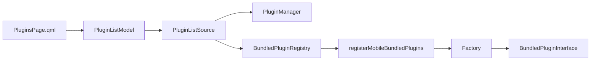

# Android bundled plugin loading

## Decision

Android uses an explicit factory registry for plugins compiled into the APK.
Each admitted plugin is built as its own bundled static library and linked into
`anykeep_mobile`; Android does not recompile plugin source files in the
application target. It does not use desktop shared-library discovery and does
not use `Q_IMPORT_PLUGIN` as the application-level contract.

The shared pieces are:

- `PluginListSource`: UI-neutral source contract used by `PluginListModel`;
- `PluginManager`: desktop dynamic-plugin implementation;
- `BundledPluginRegistry`: Android/bundled implementation;
- `BundledPluginInterface`: UI-neutral bundled lifecycle;
- `registerMobileBundledPlugins()`: explicit allow-list and factory table.

## Shared lifecycle

`RegularPluginInterface/2.0` no longer accepts the desktop `Main` shell. Dynamic
plugins implement `initialize()/shutdown()` after receiving
`PluginHostInterface`. A runtime that is also Android-compatible may implement
`BundledPluginInterface` with the same methods. Storage registration uses the
shared `NoteManager`; settings use `SettingsController` plus QML.

`ANYKEEP_BUNDLED_PLUGIN_BUILD` suppresses `Q_PLUGIN_METADATA` in bundled
static libraries. This prevents bundled classes from exporting desktop dynamic
plugin entry symbols. A bundled library owns its `.qrc` files; when a resource
object lives in a static archive, the plugin explicitly initializes that
resource with `Q_INIT_RESOURCE()` so the linker retains and registers it.
Desktop plugin libraries retain the generated JSON metadata used by `PluginManager`.

## Current Android allow-list

- Nextcloud Notes storage;
- XMPP Private Notes when QXmpp with OMEMO and QCoro are available for the target kit.

PTF remains a core storage and is registered through `registerCoreStorages()`
rather than the plugin registry.

Gemini and OpenAI Whisper are intentionally not linked into Android. Android
voice input is an opt-in platform service, enabled in application settings and
exposed by the shared toolbar only while enabled. The desktop speech-provider
plugin contract remains available; a future Android-capable provider can be
admitted explicitly without changing the platform fallback.

## Not yet admitted

- Hunspell: Android dictionary packaging/download paths need device validation;
- XMPP is omitted automatically when the target kit does not provide QXmpp
  with OMEMO and QCoro; Android packaging of those dependencies remains a kit
  responsibility;
- desktop integration, tray, global-shortcut and notification plugins: these are
  desktop services rather than Android application plugins;
- Tomboy: its backend and file-format assumptions require Android storage-access
  review.

Registration is explicit. Merely listing `android` in a plugin CMake declaration
does not put the runtime into the APK. The plugin must have a bundled static
target and a factory entry in `registerMobileBundledPlugins()`.
