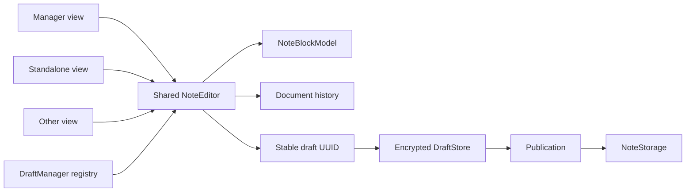

# Note architecture map

This is the entry point for note editing, persistence, movement, deletion and
recovery. Keep this file short; follow the focused document for the layer being
changed.

## Read order

| Change area | Read |
| --- | --- |
| Same note in several windows, model/view lifetime | [Live note model](note-live-model.md) |
| Move/copy, routing, format conversion, source deletion | [Transfer and publication](note-transfer-publication.md) |
| Crash windows, retry, partial remote writes | [Recovery and durability](note-recovery.md) |
| Structured QML editor internals | [Note editor architecture](note-editor-architecture.md) |
| Undo/redo | [Undo and redo](note-editor-undo-redo.md) |
| Notes manager | [Notes manager architecture](notes-manager-architecture.md) |
| Media ownership | [Media storage architecture](media-storage-architecture.md) |

## Core model

A user-visible note has one canonical in-process live model.

`DraftManager::acquireEditor()` is the production factory/registry. Storage ID
and remote note ID are mutable persistence aliases; the draft UUID is the stable
live/persistent identity.

## Non-negotiable invariants

1. One logical note has one canonical live `NoteEditor` per process.
2. Views own cursor/selection/scroll; `NoteEditor` owns document/model/history.
3. Autosave/focus loss only checkpoints the durable Editing draft. Publication
   waits for final logical close because routing must evaluate the user's final
   note state; routing may depend on tags, content, metadata or future factors
   and may perform actions far beyond selecting another storage.
4. Closing one view releases one lease; only final close may make the draft
   publishable and enter the routing/publication pipeline.
5. Moving an open note changes persistence target, not live-document identity.
6. The canonical draft is storage-independent; format conversion occurs only at
   the publication boundary.
7. Cross-storage move is destination ACK first, durable source deletion second.
8. Pre-ACK retarget is reversible; returning to the source cancels the transfer.
9. Explicit delete/recycle closes every view before removing persisted state.
10. Backend failure never discards the durable draft.
11. A concurrency token belongs to the persisted identity which produced it and
    must never be passed wholesale to a different backend.

## Ownership boundary

- **NoteEditor**: canonical in-process document and view leases.
- **DraftManager**: shared-model registry, encrypted draft state, publication,
  transfer bookkeeping and retry.
- **NoteStorage**: backend I/O and remote concurrency enforcement.
- **Workspace/shells**: presentation and commands only.

If a proposed fix needs a shell to synchronize a second copy of document state,
or lets a target storage mutate the canonical document, revisit this boundary
instead of adding another synchronization workaround.
