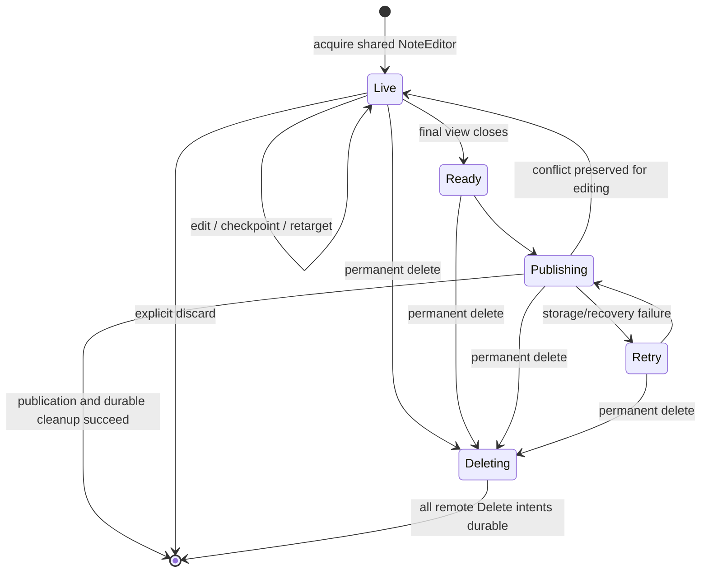
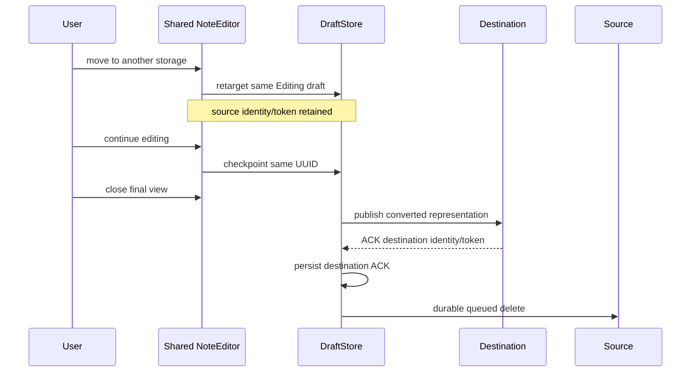

# Note lifecycle architecture

This file is the lifecycle **index**, not the exhaustive reference. Start with
[Note architecture map](note-architecture.md), then open only the focused layer
you are changing:

- [Live note model](note-live-model.md): one shared NoteEditor, views, leases,
  checkpointing, mutable persistence identity and delete/recycle lifecycle.
- [Transfer and publication](note-transfer-publication.md): routing, move/copy,
  format conversion, destination acknowledgement and source deletion.
- [Recovery and durability](note-recovery.md): persistent states, retries, crash
  windows and XMPP partial-publication repair.
- [Media storage architecture](media-storage-architecture.md): immutable blobs
  and manifest ownership.

## Vocabulary

- **Logical note**: user-visible note independent of window/storage.
- **Live model**: canonical process-local `NoteEditor`.
- **View lease**: one shell displaying that live model.
- **Draft UUID**: stable live/persistent identity.
- **Persistence alias**: mutable `storageId + remoteNoteId`.
- **Checkpoint**: durable Editing snapshot.
- **Base concurrency token**: storage-owned token captured from the persisted
  identity being edited.
- **Publication target**: storage currently selected for the draft.
- **Transfer source**: original persisted object retained until destination ACK.

## Lifecycle at a glance

Multiple windows do not create multiple Live states. They are views of the same
live model and share one draft UUID/model/history.

## Cross-storage move at a glance

Returning to the source before destination ACK cancels the transfer. It does not
create a new source object and later delete the old one.

## Invariants

1. One logical note has one canonical live model per process.
2. A shell never owns an independent authoritative document copy.
3. Editing drafts are not published while any view lease remains. Autosave is
   durability only; final close is the semantic commit point because routing
   must evaluate the final tags/content/metadata and may perform actions beyond
   storage retargeting.
4. Retarget does not change draft UUID or canonical document representation.
5. Storage-specific conversion occurs only at publication.
6. Source deletion follows destination ACK and is itself durable.
7. Source concurrency metadata is retained for reversible pre-ACK retarget but
   never leaked wholesale into another backend.
8. Permanent delete first durably retires its Publish root as `Deleting`;
   only then are concrete remote Delete intents queued. A `Deleting` root is
   never publishable and resumes that conversion after restart.
9. Delete/recycle closes all views before destroying/recycling persisted state.
10. Failure paths preserve a recoverable draft or a durable deletion obligation.
11. Remote acknowledgement followed by local failure is an ambiguous state that
    requires reconciliation, not blind repetition.

## Persistent DraftRecord roles

| Field | Role |
| --- | --- |
| `id` | stable draft/live identity |
| `state` | Editing / Ready / Publishing / Retry / NeedsRouting / Deleting |
| `storageId` | current publication target |
| `remoteNoteId` | current target's remote ID, when known |
| `removeSource*` | old persisted object during a two-phase move |
| `title/body/format/media` | canonical document snapshot |
| `backendData` | base concurrency state for the persisted identity it belongs to |
| `revision` | local monotonic checkpoint sequence |

The field names predate explicit routing and are not a perfect schema vocabulary;
their semantics above are authoritative for current code.

## Known follow-ups

Keep these as separate work items rather than solving them inside unrelated UI
fixes:

- persistent operation IDs/idempotency for lost new-note acknowledgements;
- compare-and-swap DraftStore transitions;
- cross-process editing coordination;
- explicit schema separation of route/origin if the current fields become hard
  to reason about;
- persistent recovery UI for paused publication errors.

When changing lifecycle behavior, update the focused document and its tests in
the same PR.
