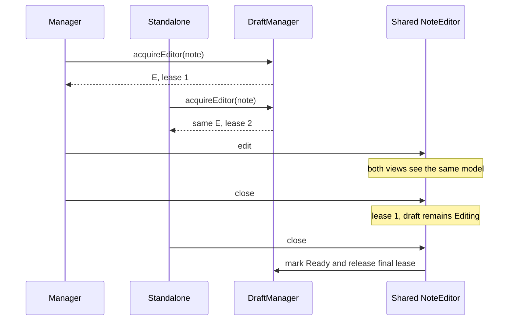

# Live note model

Read this for multi-window editing, model lifetime, view lifetime and mutable
persistence identity.

## Identity and acquisition

Production code acquires notes through
`DraftManager::acquireEditor(note, optionalDraftId)`.

Lookup priority:

1. explicit draft UUID;
2. live `storageId + noteId` alias;
3. existing draft session for that source;
4. create one new shared model.

An explicit draft UUID is stronger than a remote alias: distinct recovery or
conflict drafts must not be merged merely because they name the same source.

## Shared state versus view state

Shared in `NoteEditor`:

- `NoteBlockModel`, text, format and media;
- draft UUID, dirty/checkpoint state;
- persistence target and metadata;
- document-wide undo/redo history.

Per view:

- cursor/focus;
- selection;
- scroll/viewport;
- transient popup state.

Only `NoteBlockEditorImpl` registers as an editor view. Window roots and QWidget
hosts are shells and must not participate in history view selection.

## Leases

Each host acquisition adds one view lease and one DraftManager editing-session
lease for the same draft UUID.

`allViewsClosed` removes registry aliases. QObject deletion may happen later
because QML can still hold references during teardown; `disposable` waits for
both zero logical leases and zero registered document views.

## Checkpointing and close

Autosave/focus loss checkpoints the same draft UUID but never publishes it.
Only final logical close changes Editing to Ready/NeedsRouting.

Because all windows edit one `NoteBlockModel`, there is no whole-document
last-writer-wins synchronization between windows.

## Retargeting

`NoteEditor::retargetStorage()` changes persistence route while preserving:

- draft UUID;
- canonical content and format;
- model and undo history;
- all views.

`storageId`/`noteId` are mutable and emit `identityChanged`.
Storage-dependent capabilities emit `storageCapabilitiesChanged`.

Before destination ACK, the durable draft keeps the old persisted source
separately. The live model may therefore show a destination storage with no
remote note ID while still retaining enough durable state to cancel the move or
delete the source later.

## Delete/recycle

Explicit delete/recycle owns lifecycle. DraftManager asks the shared model to
discard/release all editing leases; every host receives the close request; only
then is the persisted note removed/recycled. A stale view cannot resurrect the
deleted source.

## Production rule

Production shells must use `DraftManager::acquireEditor()`. Direct
`NoteEditor` construction is reserved for isolated tests/tools. A new shell
adds a view to the canonical model; it does not create a second editor and
synchronize through DraftStore.
