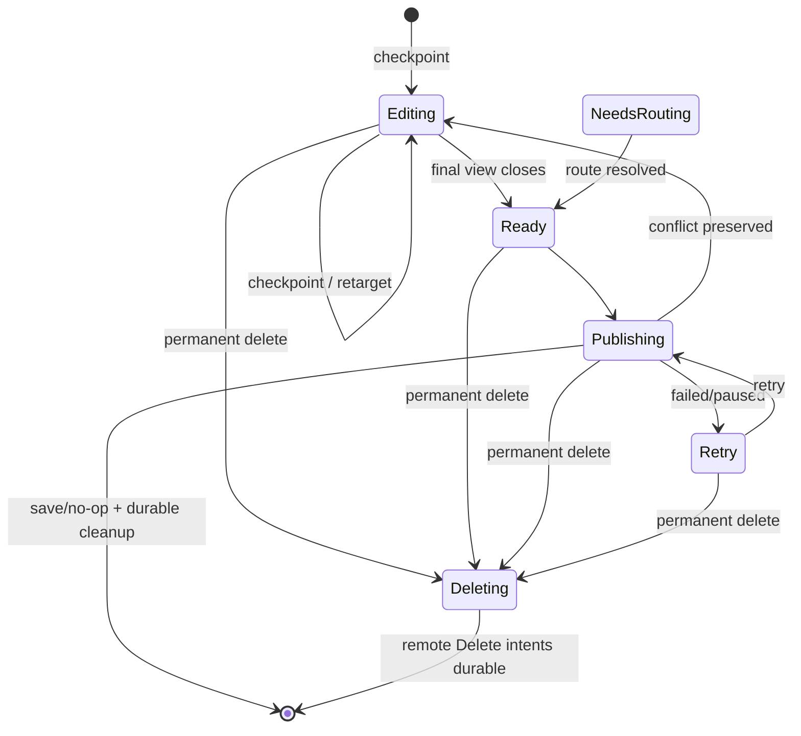

# Note recovery and durability

Read this for persistent states, retry and crash/partial-write windows.

## Persistent state machine

Delete records use Ready/Publishing/Retry and never reroute to another backend.

## Durability rules

- Editing never publishes while a live lease remains.
- Ready/Publishing/Retry/NeedsRouting/Deleting survive restart in encrypted DraftStore.
- Deleting is a durable tombstone for a former Publish root: it can only resume
  creation of concrete Delete intents and can never be reopened or republished.
- Backend failure never discards a draft.
- Existing-note conditional writes reuse the captured base token; loading a
  fresh token must not silently rebase local edits.
- Ambiguous remote side effects require reconciliation, not blind repetition.

## Move recovery

A transfer keeps source identity inside the same durable record. Destination is
published first; source deletion becomes a separate durable Delete record only
after destination ACK.

Before ACK, retarget remains reversible without changing the draft UUID or
canonical contents.

## Missing persisted identity during publication

A recovered draft can still carry a historical `storageId + remoteNoteId` even
when that object was already removed before recovery completed. If publication
loads that exact existing-note identity and the storage returns
`StorageError::NotFound`, ordinary retry is wrong: the concurrency identity no
longer exists.

For a normal publish draft with no unresolved `removeSource*` transfer leg:

1. keep the canonical durable contents and draft UUID;
2. clear `remoteNoteId`;
3. drop backend-specific concurrency metadata while preserving portable logical
   metadata such as Favorite;
4. move the draft to `NeedsRouting`;
5. evaluate routing again against the final canonical tags/content/metadata;
6. publish as a new persisted object at the resulting target.

This is deliberately different from a transient unreadable remote body (for
example the XMPP split index/content window), where the existing identity is
still believed to exist and durable snapshot repair is attempted.

A post-ACK transfer carrying `removeSource*` is excluded from this automatic
transition because two remote identities are involved; it requires transfer
reconciliation rather than guessing which object should become authoritative.

## Remote deletion while a note is open

A storage `noteRemoved` event is a concurrency event, not permission to
silently recreate the object.

If the removed alias is the live draft's current persisted identity:

1. checkpoint the current canonical shared model;
2. clear `storageId`, `remoteNoteId`, backend-specific concurrency state and
   any pending transfer-source deletion;
3. keep the draft `Editing` while views remain;
4. detach the live model from storage capability context;
5. on final close, transition to `NeedsRouting`.

The local user data remains recoverable, but closing the window cannot
resurrect the remotely deleted object.

If the removed alias is only `removeSource*` of a note already retargeted to a
different destination, the disappearance satisfies the cleanup obligation:
clear `removeSource*` and keep the destination/live model unchanged.

## XMPP split publication

Private Notes publishes content then index; those PubSub writes are not atomic.
A failure between them may leave old index metadata pointing at newer content.
Readers reject that inconsistent pair.

XMPP opts into `supportsDraftSnapshotSave()`: the encrypted draft can repair
publication without first reading a consistent remote body. Both XMPP backends
check concurrency from the index first. A genuine index revision mismatch still
loads the complete remote note and enters conflict resolution.

## Recycle preparation recovery

Recycle preparation can close views before FolderCatalog commit, but the draft
remains `Editing` and therefore non-publishable. If the catalog/native-folder
step fails or the process stops in that window, the canonical content and
recycle folder intent remain durable without having changed the remote object.
Recovery may reopen that Editing draft and retry or reroute it explicitly.

## Late acknowledgements after logical cancellation

`StorageJob::cancel()` is not proof that a remote save had no side effect. A
backend can create/update an object and deliver its acknowledgement after local
user intent has already changed.

Side-effecting save jobs are therefore retired **logically**, not forcibly made
terminally Cancelled. Their eventual success is reconciled against the current
DraftRecord:

- if the stale create target is no longer the current target, queue a durable
  Delete for the late-created remote object;
- if the target is still the same and the current draft has no remote ID yet,
  adopt the acknowledged ID/token and continue from that object instead of
  issuing another create;
- if another acknowledgement already established a different ID, the later
  created object is a duplicate and is durably deleted;
- stale success never rewrites the user's newer routing/recycle/delete decision.

This is required for pre-ACK move cancellation, recycle, retarget and reopening
a draft while a create acknowledgement is still in flight.

## Important crash windows

1. Before first checkpoint: only uncheckpointed edits are at risk.
2. Editing checkpoint written: recover Editing, never auto-publish.
3. Ready before save: retry safely.
4. Existing-note ACK before local cleanup: reconcile by identity/content/token.
5. New-note ACK before assigned ID is persisted: duplicate creation remains a
   known gap for backends without idempotency/reconciliation.
6. Explicit permanent Delete first persists the Publish root as `Deleting`,
   then durably queues concrete Delete records, then removes that root. A crash
   or DraftStore failure between those steps leaves a non-publishable cursor
   which resumes conversion on restart. A late create ACK while the root is
   Deleting is treated only as an orphan requiring durable cleanup.
7. Destination move ACK before source Delete is queued: destination identity is
   persisted first and `removeSource*` remains as the unresolved cleanup
   obligation. If the user explicitly deletes in this state, DraftManager
   durably queues deletion of **both** existing identities before discarding the
   transfer record.
8. Recovery Editing draft while target plugin is disabled: open the encrypted
   canonical snapshot using detached NoteData; storage availability is required
   for publication/capabilities, not for access to local user data.
9. Media blob before manifest: orphan is GC-safe; manifest must never reference a
   non-durable blob.

## Known follow-ups

- stable publication operation IDs/idempotency for lost new-note ACK;
- compare-and-swap DraftStore transitions;
- first-class handling of every DraftStore failure after remote side effects;
- cross-process edit coordination;
- persistent UI for paused/recovery errors.

Every new recovery path should state: authoritative persistent state, remote side
effect which may already have happened, and why retry is idempotent or reconciled.
