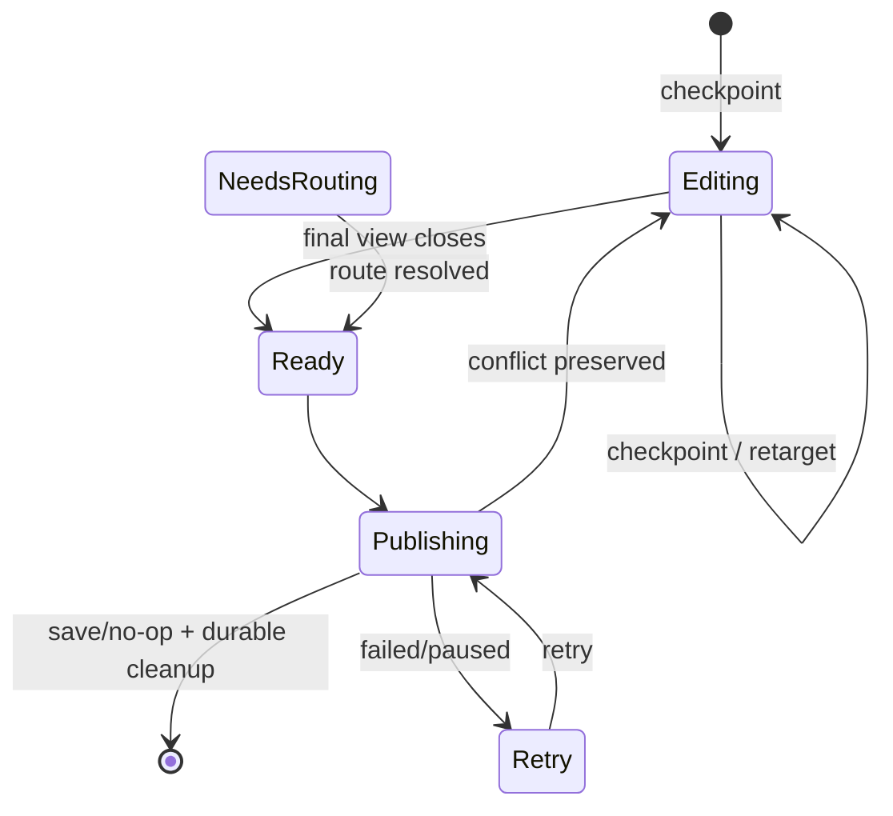

# Note recovery and durability

Read this for persistent states, retry and crash/partial-write windows.

## Persistent state machine

Delete records use Ready/Publishing/Retry and never reroute to another backend.

## Durability rules

- Editing never publishes while a live lease remains.
- Ready/Publishing/Retry/NeedsRouting survive restart in encrypted DraftStore.
- Backend failure never discards a draft.
- Existing-note conditional writes reuse the captured base token; loading a
  fresh token must not silently rebase local edits.
- Ambiguous remote side effects require reconciliation, not blind repetition.

## Move recovery

A transfer keeps source identity inside the same durable record. Destination is
published first; source deletion becomes a separate durable Delete record only
after destination ACK.

Before ACK, retarget remains reversible without changing the draft UUID or
canonical contents.

## XMPP split publication

Private Notes publishes content then index; those PubSub writes are not atomic.
A failure between them may leave old index metadata pointing at newer content.
Readers reject that inconsistent pair.

XMPP opts into `supportsDraftSnapshotSave()`: the encrypted draft can repair
publication without first reading a consistent remote body. Both XMPP backends
check concurrency from the index first. A genuine index revision mismatch still
loads the complete remote note and enters conflict resolution.

## Important crash windows

1. Before first checkpoint: only uncheckpointed edits are at risk.
2. Editing checkpoint written: recover Editing, never auto-publish.
3. Ready before save: retry safely.
4. Existing-note ACK before local cleanup: reconcile by identity/content/token.
5. New-note ACK before assigned ID is persisted: duplicate creation remains a
   known gap for backends without idempotency/reconciliation.
6. Destination move ACK before source Delete is queued: destination identity is
   persisted first so restart does not blindly create another copy.
7. Media blob before manifest: orphan is GC-safe; manifest must never reference a
   non-durable blob.

## Known follow-ups

- stable publication operation IDs/idempotency for lost new-note ACK;
- compare-and-swap DraftStore transitions;
- first-class handling of every DraftStore failure after remote side effects;
- cross-process edit coordination;
- persistent UI for paused/recovery errors.

Every new recovery path should state: authoritative persistent state, remote side
effect which may already have happened, and why retry is idempotent or reconciled.
