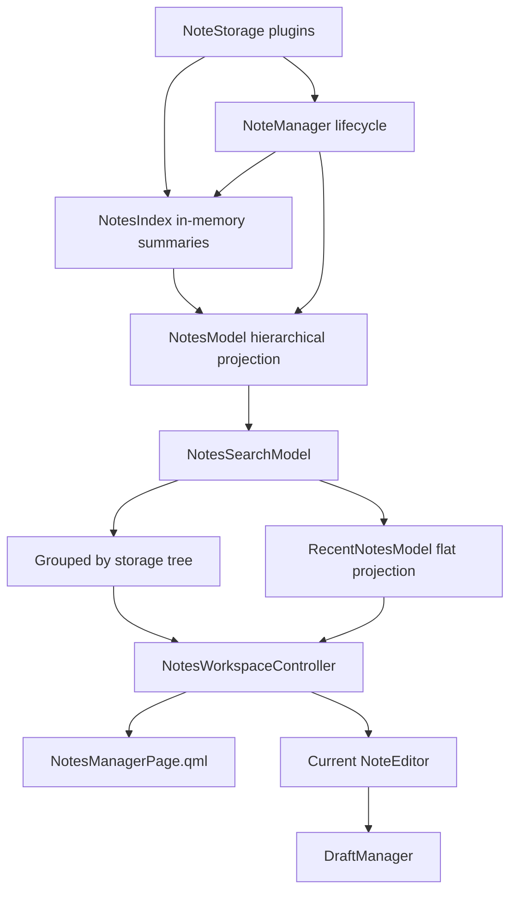

# Notes manager architecture

## Scope

The notes manager is a shared model/controller/QML feature. Desktop presents it
in a pure Qt Quick top-level window. Android presents the same models and page
through mobile navigation. No manager-specific editor or draft implementation
is allowed.

## Models and views

Two user-facing projections are implemented:

1. **Recent** — a flat list sorted by modification time. Storage headings are
   omitted; the storage is represented by its note icon and a hover tooltip.
2. **By storage** — a tree whose storage rows contain note rows.

Folder grouping is intentionally not simulated with tags or a second storage
loader. It will be added later as another projection once folder identity,
nesting, moves and cross-storage semantics are specified.

Both current modes use compact, vertically centred one-line rows. Desktop rows
are 34 px; touch rows retain a 44 px target. Background is only shown for hover
or selection. Failed or unavailable icon resources have textual fallbacks, and
the core tray icon is linked into the Android target.

## Search

The view selector is a tab bar. On desktop the title/tag filter remains visible
without taking initial focus; **Search in text** is shown while the field is in
use. Android keeps the compact search button and uses the same filtering model.

`NotesSearchModel` filters title and tags synchronously and optionally launches
the shared asynchronous body finder. `RecentNotesModel` is a projection of the
filtered hierarchical model, so search does not create a second refresh path.

## Ownership

`NoteManager` owns one `NotesIndex`. The index keeps the current per-storage
in-memory snapshot of note summaries plus loading and error state. It starts the
first refresh after initialization succeeds, or after initialization fails when
the storage is still readable through an offline cache. It then updates the
snapshot from storage add/modify/remove/id-change signals. Full note bodies and
media are not retained; loaded updates are reduced to metadata and a short
preview.

`NotesModel` is only a hierarchical, paginated presentation of `NotesIndex` and
keeps the rows currently exposed to a view. It does not maintain another full
copy of each storage's note list. Tray, DBus and other non-QML consumers obtain
the same snapshot through `NoteManager::noteList()`. The shared QML collection
requests the next storage page when its currently exposed tail approaches the
visible viewport.

Local `FileStorage` implementations do not cache note objects. Their
`noteList()` scans the selected directory and returns a fresh list whenever the
central index explicitly refreshes. Successful local writes update the index
through storage signals; external filesystem changes become visible on refresh.
Remote storage implementations may still maintain protocol/offline caches as
part of their backend, but those caches are distinct from the application-wide
notes index.

`NotesWorkspaceController` owns only selection, asynchronous open/move/delete
commands and the current shared `NoteEditor`. Draft leases, checkpoint, reload
and publication remain inside `NoteEditor` and `DraftManager`.

## Desktop and Android

Desktop uses `NotesManagerWindow.qml`. Android starts in Recent mode and exposes
swipe-right deletion plus Delete in the open-note toolbar. Desktop defaults to
By storage. The same `NotesManagerPage.qml` implements both layouts.

## ABI

The notes-manager migration originally introduced ABI version 2. The subsequent
QWidget-free plugin/storage settings and `QWindow` desktop-integration contracts
raise the current libanykeep ABI to 3.
