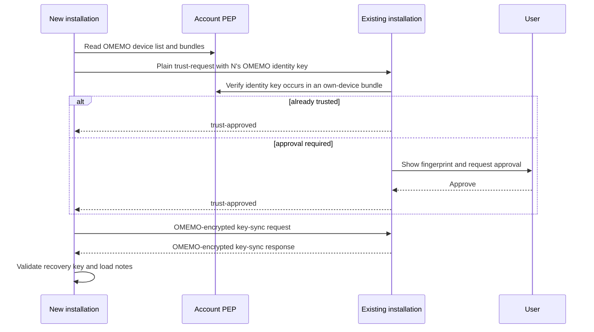

# Private Encrypted Notes over XMPP

Status: **ProtoXEP / implementation draft**
Version: **0.7**
Namespaces: `urn:xmpp:private-notes:0`, `urn:xmpp:private-notes:folders:0`, `urn:xmpp:private-notes:content:0`, `urn:xmpp:private-notes:media:0`, `urn:xmpp:private-notes:key-sync:0`

> This document describes the protocol implemented by Private Notes. It has not been
> submitted to or accepted by the XMPP Standards Foundation and does not have
> an assigned XEP number. Namespace names are provisional until standardization.

## Abstract

This specification defines a private, end-to-end encrypted note store built on
Personal Eventing Protocol (PEP), and a protocol for transferring its storage
key between a user's own authenticated OMEMO devices.

Notes are represented by separate index and content records. The server can
route changes and enumerate records, but cannot read note titles, tags,
timestamps, bodies, revisions, or the storage master key. Optimistic revisions
prevent silent overwrites. A user-approved trust bootstrap permits a new
installation to establish an OMEMO session with an existing installation
before the devices were previously trusted.

## Conformance language

The key words **MUST**, **MUST NOT**, **REQUIRED**, **SHOULD**, **SHOULD NOT**,
and **MAY** are to be interpreted as described by BCP 14 when, and only when,
they appear in all capitals.

An *account* is an XMPP bare JID. An *installation* is one Private Notes instance with
a stable XMPP resource and OMEMO device. A *storage key* is the 32-byte secret
used to derive the encryption keys for note records. A *note ID* and a
*revision* are opaque, non-empty strings; Private Notes generates UUIDs for both.

## Dependencies

An implementation of this protocol depends on:

- XMPP Core and Instant Messaging and Presence;
- Service Discovery (XEP-0030);
- Publish-Subscribe (XEP-0060) and PEP (XEP-0163);
- Persistent Storage of Private Data via PubSub (XEP-0223);
- OMEMO Encryption (XEP-0384) for storage-key transport;
- File Metadata Element (XEP-0446), Stateless File Sharing (XEP-0447), and
  Stateless File Sharing Encryption (XEP-0448) for note attachments;
- HTTP File Upload (XEP-0363) for a persistent attachment source;
- Jingle File Transfer (XEP-0234) and Publishing Available Jingle Sessions
  (XEP-0358) for an optional direct attachment source;
- AES-256-GCM, HKDF-SHA-256, SHA-256, and a cryptographically secure random
  number generator.

OMEMO device lists, bundles, sessions, and trust are not redefined here.

## Protocol identifiers

The incompatible major version of the note-storage protocol is identified by
one namespace:

```text
urn:xmpp:private-notes:0
```

The same identifier is the default configured base node and the XML namespace
for all core note-storage elements. Two leaf nodes are derived from it:

| Purpose | Node |
| --- | --- |
| Search/list metadata | `<base>:index` |
| Note body | `<base>:content` |

The default nodes are therefore:

```text
urn:xmpp:private-notes:0:index
urn:xmpp:private-notes:0:content
```

The final `0` identifies this initial experimental protocol version. An
incompatible change requires a new namespace and new nodes, for example
`urn:xmpp:private-notes:1`, `urn:xmpp:private-notes:1:index`, and
`urn:xmpp:private-notes:1:content`. No minor-version field is defined.
Compatible additions use optional XML in separate namespaces or authenticated
`required` feature declarations as described below.

Direct key synchronization is a separate protocol and uses
`urn:xmpp:private-notes:key-sync:0`.

## Discovery and server requirements

Before using the store, a client MUST discover its own bare JID and verify:

1. a `pubsub/pep` service identity is advertised; and
2. `http://jabber.org/protocol/pubsub#publish-options` is advertised.

Every Private Notes installation capable of key transfer MUST advertise:

```xml
<feature var='urn:xmpp:private-notes:key-sync:0'/>
```

An implementation capable of materializing and publishing the media extension
SHOULD additionally advertise:

```xml
<feature var='urn:xmpp:private-notes:media:0'/>
```

An installation SHOULD use a stable, distinct XMPP resource. A requester MUST
send key-sync IQs to a full JID discovered as online and advertising the
feature; it MUST NOT send a storage key to a bare JID.

The index node notification feature is advertised as the node followed by
`+notify`, for example:

```xml
<feature var='urn:xmpp:private-notes:0:index+notify'/>
```

## PEP node configuration

Both nodes MUST be leaf nodes and MUST be configured with at least:

| PubSub option | Required value |
| --- | --- |
| `pubsub#access_model` | `whitelist` |
| `pubsub#persist_items` | `true` |
| `pubsub#max_items` | `max`, or the largest safe server value |
| `pubsub#deliver_payloads` | `true` |
| `pubsub#notify_retract` | `true` |
| `pubsub#type` | `urn:xmpp:private-notes:0` |

A client MUST verify the effective access model and persistence after creating
or repairing a node. It MUST refuse to publish private note data if the node is
not allowlist-only and persistent. Publish requests MUST repeat the
allowlist/persistence requirements using publish-options when supported.

Example configuration form (irrelevant server-specific fields omitted):

```xml
<iq type='set' id='configure-index' to='romeo@example.net'>
  <pubsub xmlns='http://jabber.org/protocol/pubsub#owner'>
    <configure node='urn:xmpp:private-notes:0:index'>
      <x xmlns='jabber:x:data' type='submit'>
        <field var='FORM_TYPE' type='hidden'>
          <value>http://jabber.org/protocol/pubsub#node_config</value>
        </field>
        <field var='pubsub#access_model'><value>whitelist</value></field>
        <field var='pubsub#persist_items'><value>true</value></field>
        <field var='pubsub#deliver_payloads'><value>true</value></field>
        <field var='pubsub#notify_retract'><value>true</value></field>
        <field var='pubsub#type'>
          <value>urn:xmpp:private-notes:0</value>
        </field>
      </x>
    </configure>
  </pubsub>
</iq>
```

## Encrypted record syntax

Each PubSub item contains exactly one `encrypted` element in the protocol
namespace:

```xml
<item id='2b7e1516-28ae-4d2a-abf7-158809cf4f3c'>
  <encrypted xmlns='urn:xmpp:private-notes:0'
             key-id='tTvC-q553JtqzHXstinSd2A0CDzSXK40wXTK5a0Cddk'>
    <nonce>AAECAwQFBgcICQoL</nonce>
    <payload>...BASE64-CIPHERTEXT...</payload>
    <tag>...BASE64-GCM-TAG...</tag>
  </encrypted>
</item>
```

The PubSub item `id` is the note ID and MUST be non-empty. `key-id` is
canonical unpadded Base64url of the 32-byte storage-key identifier. `nonce` is
canonical padded Base64 of exactly 12 bytes, `payload` is canonical padded
Base64 of the non-empty AES-GCM ciphertext, and `tag` is canonical padded
Base64 of exactly 16 bytes.

The actual PubSub node determines whether the item is an index or content
record. No `kind`, `wire`, or `schema` attribute is carried. The namespace
already identifies the incompatible major version, and the decrypted record
type is verified against the node after authentication.

Receivers MAY ignore XML whitespace within Base64 text, but padding characters
and padding bits MUST be canonical. Unknown optional attributes or child
elements on `encrypted` MUST use another namespace. They are not authenticated
and MUST NOT affect key selection, decryption, or record semantics.

### XML processing and extensibility

The decrypted plaintext is a UTF-8 XML document. XML prefixes, attribute order,
empty-element spelling, and insignificant whitespace are not protocol data. A
sender is not required to reproduce another implementation's byte-for-byte XML
serialization. XML canonicalization is deliberately not part of this protocol.

Receivers MUST reject malformed XML, document type declarations, entity
declarations, non-declaration processing instructions, duplicate required
feature declarations, and structures exceeding implementation-appropriate
limits. The current Private Notes implementation limits one plaintext or ciphertext
field to 16 MiB, nesting to 32 levels, 8192 elements, and 256 attributes per
element.

Compatible additions MUST use their own XML namespaces. Unknown elements or
unqualified attributes in the current core namespace are malformed. An
implementation MUST preserve unknown optional authenticated foreign-namespace
attributes and subtrees when rewriting a record. An extension required for correct interpretation is declared
inside the authenticated envelope:

```xml
<required xmlns='urn:xmpp:private-notes:0'
          feature='urn:example:private-notes:media:1'/>
```

Feature identifiers SHOULD be URIs or URNs. An implementation that does not
support a listed feature MAY display safely understood core data, but MUST NOT
rewrite the record. Changing the meaning or requiredness of an existing core
field requires a new major namespace; no minor-version number is needed.

The envelope/content arrangement and authenticated context element follow the
general design principle of Stanza Content Encryption (XEP-0420), but this is
not an SCE profile: decrypted records remain PubSub application data.

### Storage key identifier

For a 32-byte storage master key `K`, the identifier is:

```text
SHA-256("private-notes storage key id v1" || 0x00 || K)
```

The identifier is not secret. It allows a client to select a candidate key
without attempting decryption and allows an audit to group records by key.

### Key separation

Index and content encryption keys are derived independently using HKDF-SHA-256
as defined by RFC 5869. For the 32-byte storage master key `K`:

```text
IKM  = K
salt = UTF-8("private-notes HKDF salt v1")
info = UTF-8("private-notes key domain v1:" || domain)
L    = 32

PRK = HKDF-Extract(salt, IKM)
OKM = HKDF-Expand(PRK, info, L)
```

`domain` is the ASCII string `storage-index` or `storage-content`; `OKM` is used
directly as the AES-256-GCM key. An implementation using an RFC 5869 HKDF API
MUST pass `info` exactly as shown and MUST NOT append a block counter itself.
For this 32-byte output, the equivalent manual expansion is:

```text
PRK = HMAC-SHA-256(salt, IKM)
OKM = HMAC-SHA-256(PRK, info || 0x01)
```

Here `0x01` is the RFC 5869 `T(1)` block counter generated by HKDF-Expand; it is
not part of the `info` parameter.

### AES-GCM framing

Protocol major 1 uses AES-256-GCM with an unpredictable 96-bit nonce and a 128-bit tag.
The AES-GCM additional authenticated data (AAD) is the empty byte string. APIs
that return `ciphertext || tag` MUST split the final 16 bytes into `tag`; APIs
that accept separate fields use the three values directly.

The outer XML attributes and fields are not supplied as GCM AAD. The PubSub
node and item bindings are included in the encrypted XML and checked after
successful GCM authentication.

### Authenticated XML envelope

AES-GCM plaintext contains one envelope in the protocol namespace:

```xml
<envelope xmlns='urn:xmpp:private-notes:0'>
  <node>urn:xmpp:private-notes:0:index</node>
  <content>
    <index id='2b7e1516-28ae-4d2a-abf7-158809cf4f3c'
           revision='018f0be0-df0d-7c70-a2ef-1f5c973ec92a'
           modified='2026-07-27T18:00:00.123Z'
           format='markdown'>
      <title>Portable note</title>
      <tag>one</tag>
      <tag>two</tag>
    </index>
  </content>
</envelope>
```

The envelope MUST contain exactly one `node` and one `content`. `node` MUST
equal the complete PubSub node from which the item was obtained. `content` MUST
contain exactly one `index` on the index node or exactly one `note` on the
content node. The record `id` MUST equal the outer PubSub item ID. These checks
bind authenticated ciphertext to its node and item without duplicating record
fields in a separate context object.

### Index record

An index record is metadata used for listing and synchronization:

```xml
<index
       id='2b7e1516-28ae-4d2a-abf7-158809cf4f3c'
       revision='018f0be0-df0d-7c70-a2ef-1f5c973ec92a'
       parent-revision='optional-parent-revision'
       origin-id='device-a'
       modified='2026-07-27T18:00:00.123Z'
       format='markdown'>
  <title>Portable note</title>
  <tag>one</tag>
  <tag>two</tag>
  <folder xmlns='urn:xmpp:private-notes:folders:0'>
    <segment>Projects</segment>
    <segment>2026</segment>
  </folder>
</index>
```

`id`, `revision`, and `modified` MUST be non-empty. `modified` MUST be an ISO
8601 UTC instant ending in `Z`. Protocol major 1 defines only the format value `markdown`. Exactly one `title` is required; zero or more `tag` elements are
allowed. `parent-revision` and `origin-id` are optional. The optional folder
path is defined by the `urn:xmpp:private-notes:folders:0` extension below.

`revision` is the revision of the complete index and is the optimistic
concurrency token. Normally it also identifies the corresponding content
record. An index-only metadata update uses the required content-revision
extension below to retain the body revision while generating a new index
revision.

### Folder-path extension

An index MAY contain at most one direct `<folder/>` child in the
`urn:xmpp:private-notes:folders:0` namespace. Its absence means the note is
unsorted. If present, it MUST contain one or more direct `<segment/>` children
in the same namespace. A segment MUST be non-empty and already trimmed; a
folder or segment MUST NOT have attributes or other child elements.

The ordered segments represent the root-to-leaf folder path. They deliberately
carry names rather than Private Notes's local folder UUIDs: each installation merges
the observed path into its own shared folder catalog and retains its stable
local UUID mapping. The extension remains inside the encrypted index payload,
so it is not visible to the XMPP server.

### Content-revision extension

An index-only update changes metadata such as the folder without uploading the
body again. Its index revision MUST be fresh, but the existing content record
still carries the old body revision. In that case the envelope MUST declare
the required `urn:xmpp:private-notes:content:0` feature and the index MUST
carry exactly one extension child:

```xml
<envelope xmlns='urn:xmpp:private-notes:0'>
  <node>urn:xmpp:private-notes:0:index</node>
  <required feature='urn:xmpp:private-notes:content:0'/>
  <content>
    <index id='note-id' revision='folder-revision'
           modified='2026-07-27T18:01:00.123Z' format='markdown'>
      <title>Portable note</title>
      <content-revision xmlns='urn:xmpp:private-notes:content:0'>
        body-revision
      </content-revision>
    </index>
  </content>
</envelope>
```

The `content-revision` value MUST be non-empty, MUST have no attributes or
child elements, and MUST differ from the index `revision`. Its required feature
declaration MUST appear exactly once. If the extension is absent, the content
revision is the index revision for compatibility with earlier records. A
client that does not support this required extension MUST treat the index as
unsupported and MUST NOT rewrite it.

### Content record

A content record contains the note body:

```xml
<note
      id='2b7e1516-28ae-4d2a-abf7-158809cf4f3c'
      revision='018f0be0-df0d-7c70-a2ef-1f5c973ec92a'>
  <body>Portable body</body>
</note>
```

The content ID and revision MUST exactly match the corresponding decrypted
index **content revision**. When the required content-revision extension is
absent, that is the index `revision`; when it is present, it is the extension
value. The body MAY be empty. A mismatch MUST be treated as incomplete or
inconsistent remote state, never as valid note content.


### Media extension

A content record MAY carry attachments as direct XEP-0447 `file-sharing`
children of the `note` element. A record containing at least one attachment
MUST declare the authenticated required feature:

```xml
<required xmlns='urn:xmpp:private-notes:0'
          feature='urn:xmpp:private-notes:media:0'/>
```

Each attachment MUST have a distinct UUID `id`. The UUID is the stable
attachment identity used by `anykeep-media:` references in Markdown and MUST
not be replaced merely because a remote source or Jingle publication changes.
The XEP-0446 metadata describes the **plaintext** file and, for this profile,
MUST contain its size and SHA-256 hash. A sender SHOULD include a filename and
media type.

The attachment payload MUST be represented by exactly one XEP-0448 encrypted
source. The encrypted source MUST contain a SHA-256 hash of the complete
ciphertext representation and MUST contain at least one persistent XEP-0363
`url-data` source. The current profile uses AES-256-GCM. The XEP-0448 key and
IV are therefore note metadata and are protected by the authenticated and
encrypted Private Notes content record; they MUST NOT be published separately
in cleartext application metadata.

A sender MUST additionally include an XEP-0358 `jinglepub` source describing
XEP-0234 file transfer. The HTTP and Jingle sources MUST serve the same XEP-0448
ciphertext bytes. This permits a receiver to prefer direct Jingle transfer but
fall back to HTTP without changing the attachment's cryptographic identity.
The Jingle transfer advertises the ciphertext size and ciphertext SHA-256, not
the plaintext metadata.

Example, with Base64 values shortened for readability:

```xml
<note xmlns='urn:xmpp:private-notes:0'
      id='2b7e1516-28ae-4d2a-abf7-158809cf4f3c'
      revision='018f0be0-df0d-7c70-a2ef-1f5c973ec92a'>
  <body></body>
  <file-sharing xmlns='urn:xmpp:sfs:0'
                id='45b22c0e-956d-4c65-9a77-7d52ef142c1d'
                disposition='inline'>
    <file xmlns='urn:xmpp:file:metadata:0'>
      <media-type>image/png</media-type>
      <name>diagram.png</name>
      <size>123456</size>
      <hash xmlns='urn:xmpp:hashes:2' algo='sha-256'>...</hash>
    </file>
    <sources>
      <encrypted xmlns='urn:xmpp:esfs:0'
                 cipher='urn:xmpp:ciphers:aes-256-gcm-nopadding:0'>
        <key>...</key>
        <iv>...</iv>
        <hash xmlns='urn:xmpp:hashes:2' algo='sha-256'>...</hash>
        <sources xmlns='urn:xmpp:sfs:0'>
          <url-data xmlns='http://jabber.org/protocol/url-data'
                    target='https://upload.example/opaque.bin'/>
          <jinglepub xmlns='urn:xmpp:jinglepub:1'
                     from='romeo@example.net/AnyKeep-device'
                     id='published-session-id'>
            <description xmlns='urn:xmpp:jingle:apps:file-transfer:5'/>
          </jinglepub>
        </sources>
      </encrypted>
    </sources>
  </file-sharing>
</note>
```

A receiver MUST verify the encrypted SHA-256 before decryption, authenticate
XEP-0448 decryption, then verify the plaintext size and SHA-256 before installing
the bytes into its local media store. A transport failure is not an integrity
failure: the receiver MAY try another source for the same encrypted payload.
An integrity or authentication failure MUST be treated as a security/data error.

A client that does not support `urn:xmpp:private-notes:media:0` MAY display the
safely understood core note body but MUST NOT rewrite the content record. This
prevents an attachment-unaware client from silently deleting media descriptors.

## Synchronization operations

### Listing and loading

A client lists item IDs from the index node, then requests index items in
batches. The Private Notes implementation uses batches of 50. A server or library MAY
use RSM pagination instead. If only a truncated page can be obtained, the
result MUST be marked partial; the client MUST NOT infer that missing local
notes were deleted.

To load a note, the client requests and validates its index item, then requests
and validates the content item with the same ID and the index's content
revision. Because the two items are stored in separate nodes, a reader can
observe an old index and new content while a writer is between the two
publications. An ID/revision mismatch in this specific situation SHOULD be
treated as a transient inconsistent snapshot: the reader SHOULD request both
items again. It MUST NOT combine the two revisions or report either payload as
corrupt solely because of this race.

### Creating and updating

For a new note, the client generates a note ID and revision. For an update, it
MUST first load the current server index and compare its revision with the
revision on which the local edit was based. If they differ, the client MUST
report a conflict and MUST NOT silently publish over the remote revision.

On a successful full update the old revision becomes `parentRevision`, a new
index revision is generated, that same value becomes the content revision, and
`modified` is set to the current UTC time.

The content item MUST be published before the index item. This ordering avoids
an index notification pointing to content that has not yet been uploaded.
Publication is not transactional: after interruption, a content record can be
newer than the index. Readers MUST regard the index revision as authoritative;
writers SHOULD retry or repair incomplete publication.

An index-only metadata update MUST first compare the current index revision
with its local base revision. On success it sets the old index revision as
`parentRevision`, creates a fresh index revision, preserves the current content
revision through the required extension, and publishes only the index item.
It MUST NOT publish the unchanged content item merely to change a folder or
other index metadata.

A pending full-body edit MAY rebase over one direct index-only update made by
the same installation. This exception is safe only when the server index has
the same `origin-id`, names the local base as `parent-revision`, and resolves
to the same content revision as the local edit. The full publication then uses
that server index revision as its parent. A client MUST treat every other
revision mismatch—including an update from another resource of the same
account—as a conflict.

### Concurrent updates and conflict resolution

The revision comparison above is optimistic rather than an atomic
compare-and-swap. Two writers can load the same revision, both pass the check,
and publish different child revisions with the same `parentRevision`. These are
called *sibling revisions*. The last index item accepted by the PubSub service
is the visible remote version, but the other edit MUST NOT be silently lost by
a client that still has its plaintext or durable draft.

Conflict detection and conflict resolution are separate concerns. This
protocol requires a client to preserve the losing local edit and expose it to
a resolution policy; it does not prescribe a user interface or merge
algorithm. A policy MAY merge the versions, retain the draft for a later
decision, discard it with explicit user consent, or publish it as a new note
with a new note ID. Publishing a conflict copy MUST clear the old revision and
parent-revision metadata so that it is a genuine create operation rather than
another update of the contested item.

Private Notes's default lossless policy keeps the server winner under the original
note ID and publishes the losing local edit as a new note titled
`<title> (conflict <local time>)`. It also notifies the user. For a conflict
detected before publication, the remote note is passed directly to the policy.
For sibling revisions detected from a PEP event after publication, only the
installation that authored the displaced cached revision creates the copy;
other installations simply converge on the server winner. `originId` is used
to make that ownership decision and avoid duplicate conflict copies.

Conflict drafts SHOULD be persisted before invoking an interactive or
asynchronous resolver. A crash, restart, resolver cancellation, or temporary
publication failure MUST NOT discard the losing edit.

Example index publication:

```xml
<iq type='set' id='publish-index' to='romeo@example.net'>
  <pubsub xmlns='http://jabber.org/protocol/pubsub'>
    <publish node='urn:xmpp:private-notes:0:index'>
      <item id='2b7e1516-28ae-4d2a-abf7-158809cf4f3c'>
        <encrypted xmlns='urn:xmpp:private-notes:0'
                   key-id='tTvC-q553JtqzHXstinSd2A0CDzSXK40wXTK5a0Cddk'>
          <nonce>AAECAwQFBgcICQoL</nonce>
          <payload>...BASE64-CIPHERTEXT...</payload>
          <tag>...BASE64-GCM-TAG...</tag>
        </encrypted>
      </item>
    </publish>
    <publish-options>
      <x xmlns='jabber:x:data' type='submit'>
        <field var='FORM_TYPE' type='hidden'>
          <value>http://jabber.org/protocol/pubsub#publish-options</value>
        </field>
        <field var='pubsub#access_model'><value>whitelist</value></field>
        <field var='pubsub#persist_items'><value>true</value></field>
      </x>
    </publish-options>
  </pubsub>
</iq>
```

### Deleting

Deletion retracts the index item first, then the content item, with subscriber
notification requested. This makes the note disappear from normal listings as
soon as possible. `item-not-found` is idempotent success. A client MUST retain
and retry the second retraction after a transient failure; it SHOULD eventually
clean up orphaned content.

### Events

Clients process publish and retract events only for the configured index node
and only when they originate from the user's own PEP service. A server MAY omit
the service JID where the PEP context is unambiguous. A purge or node deletion
invalidates the complete local view and requires a fresh synchronization.

```xml
<message type='headline' from='romeo@example.net'
         to='romeo@example.net/private-notes-laptop'>
  <event xmlns='http://jabber.org/protocol/pubsub#event'>
    <items node='urn:xmpp:private-notes:0:index'>
      <retract id='2b7e1516-28ae-4d2a-abf7-158809cf4f3c'/>
    </items>
  </event>
</message>
```

## Storage-key synchronization

The storage key is transferred only between full JIDs belonging to the same
bare JID. The responder MUST require explicit user approval unless the
requester's OMEMO identity is already manually trusted or authenticated.

The complete onboarding sequence is:



### Trust bootstrap request

Before an OMEMO session exists, the requester sends a plaintext IQ to the
existing installation. Its `senderKey` is the standard-Base64 OMEMO identity
public key of the requesting device. It is public authentication material, not
the storage key.

```xml
<iq type='set'
    from='romeo@example.net/private-notes-new'
    to='romeo@example.net/private-notes-existing'
    id='86de9c36-bc10-41e2-b239-b202de0b0a19'>
  <key-sync xmlns='urn:xmpp:private-notes:key-sync:0'>
    {&quot;requestId&quot;:&quot;86de9c36-bc10-41e2-b239-b202de0b0a19&quot;,
     &quot;senderKey&quot;:&quot;ht4nXjYzM9...BASE64...WLQ=&quot;,
     &quot;type&quot;:&quot;trust-request&quot;}
  </key-sync>
</iq>
```

Whitespace is shown for readability; Private Notes sends compact JSON. `requestId`
MUST be non-empty and SHOULD equal the IQ `id`. The receiver MUST verify all of
the following before displaying or approving the request:

1. the sender bare JID equals the configured account bare JID;
2. the stanza is not marked as end-to-end encrypted;
3. `senderKey` decodes to a non-empty public identity key;
4. the same key occurs in a currently published OMEMO bundle for another device
   in the account's OMEMO device list.

This PEP lookup prevents an arbitrary same-account resource from substituting
an unrelated key. It does not replace user fingerprint verification.

### Trust acknowledgement

After approval, the responder assigns an OMEMO trust level to the identity and
returns a plaintext result:

```xml
<iq type='result'
    from='romeo@example.net/private-notes-existing'
    to='romeo@example.net/private-notes-new'
    id='86de9c36-bc10-41e2-b239-b202de0b0a19'>
  <key-sync xmlns='urn:xmpp:private-notes:key-sync:0'>
    {&quot;requestId&quot;:&quot;86de9c36-bc10-41e2-b239-b202de0b0a19&quot;,
     &quot;type&quot;:&quot;trust-approved&quot;}
  </key-sync>
</iq>
```

This acknowledgement MUST NOT contain the storage key. The requester MUST
match both IQ ID and JSON `requestId`.

### Encrypted key request

The requester next sends an IQ whose application payload, after OMEMO
decryption, is:

```xml
<iq type='set' id='278a35de-3aa8-40e5-bc49-a2ad697b9803'>
  <key-sync xmlns='urn:xmpp:private-notes:key-sync:0'>
    {&quot;requestId&quot;:&quot;278a35de-3aa8-40e5-bc49-a2ad697b9803&quot;,
     &quot;type&quot;:&quot;request&quot;}
  </key-sync>
</iq>
```

On the wire, the application element is carried by the implementation's OMEMO
IQ envelope, for example:

```xml
<iq type='set'
    from='romeo@example.net/private-notes-new'
    to='romeo@example.net/private-notes-existing'
    id='278a35de-3aa8-40e5-bc49-a2ad697b9803'>
  <encrypted xmlns='urn:xmpp:omemo:2'>...</encrypted>
</iq>
```

The receiver MUST ignore a `type=request` payload that was not obtained through
authenticated end-to-end decryption. It MUST bind the pending request to the
sender full JID, IQ ID, OMEMO sender identity, and encryption metadata.

### Encrypted key response

After the requester identity is trusted, the responder returns an
OMEMO-protected IQ result. No second prompt is required: approval of an
untrusted identity authorizes this storage-key request. Its decrypted
application payload is:

```xml
<iq type='result' id='278a35de-3aa8-40e5-bc49-a2ad697b9803'>
  <key-sync xmlns='urn:xmpp:private-notes:key-sync:0'>
    {&quot;recoveryKey&quot;:&quot;private-notes-key-v1:BASE64URL_KEY:12ab34cd56ef&quot;,
     &quot;requestId&quot;:&quot;278a35de-3aa8-40e5-bc49-a2ad697b9803&quot;,
     &quot;type&quot;:&quot;response&quot;}
  </key-sync>
</iq>
```

The response MUST be encrypted using the metadata/session associated with the
accepted request. A receiver MUST verify the IQ ID, `requestId`, response type,
OMEMO authentication, recovery-key syntax, key length, and checksum before
installing the key.

The recovery key syntax is:

```text
private-notes-key-v1:<unpadded-base64url-32-byte-key>:<12-lowercase-hex-digits>
```

The checksum is the first six bytes of the storage key identifier. It detects
copying and framing errors; it is not an authentication mechanism. OMEMO and
explicit trust provide authentication.

### Rejection and timeout

The current protocol deliberately does not reveal whether a request was
rejected, expired, malformed, or referred to an unknown identity: the receiver
may discard it and the requester observes a timeout. An implementation MAY
return an XMPP IQ error, but MUST NOT include the storage key or sensitive trust
state in an error. Pending requests SHOULD expire locally and MUST NOT be reused
after completion or rejection.

Transient transport errors MAY be retried with a new request ID. User rejection,
invalid credentials, malformed data, failed identity verification, or a
permanent authorization error MUST NOT be retried automatically.

## Multiple storage keys and migration

An account can contain notes written with different storage keys, for example
after independently initialized installations were used. A client MAY audit
index records by `key-id`, request candidate keys from trusted online
installations, and ask the user to select one canonical key.

Migration MUST decrypt both index and content with the record's old key,
validate their IDs and revisions, re-encrypt both with the canonical key, then
publish content before index. Records for which no matching key is available
MUST remain untouched and MUST be reported as inaccessible.

## Explicit maintenance of obsolete development records

Pre-release builds used the legacy nodes
`urn:xmpp:private-notes:0:index:1` and
`urn:xmpp:private-notes:0:content:1`, plus earlier encrypted payload namespaces.
Those nodes are outside the current major namespace and are never read as
current records. An implementation MAY expose an explicit legacy-node
maintenance action. It MUST require confirmation and re-fetch each candidate
immediately before retraction.

The action MAY remove only data positively identified as an obsolete
pre-release format or as structurally malformed for the current major. It MUST
NOT delete data in an unknown future major namespace, data requiring an unknown
extension, data encrypted with another key, or ciphertext that merely fails
authentication.

## Error handling

Errors fall into three classes:

| Class | Examples | Required behavior |
| --- | --- | --- |
| Permanent configuration | bad credentials, no PEP, no publish-options, public/non-persistent node | stop and require user/configuration action |
| Data/authentication | unknown major namespace, wrong key ID, GCM failure, persistent ID/revision mismatch, unverified key-sync sender | do not overwrite or auto-repair ciphertext; report or ignore safely |
| Transient | disconnected network, timeout, temporary server error, index/content mismatch during a publication window | retain the operation and retry with bounded exponential backoff; retry a complete note snapshot for a publication-window mismatch |

A malformed, obsolete, unsupported, or individually undecryptable PubSub item
MUST NOT make the entire storage unavailable. A list operation MUST skip and
report that item while continuing to process other records. Loading that
specific note MAY fail. A storage-wide error state is reserved for account,
configuration, server-capability, or genuinely global key failures. If every
otherwise well-formed record advertises a different storage key, the client MAY
start explicit key recovery instead of returning an empty successful list.

Publication and deletion are multi-step operations. A conforming writer SHOULD
persist enough encrypted operation state to resume after restart. It MUST NOT
discard an acknowledged conflict and MUST NOT convert a partial list into
deletions.

## Security considerations

### Server-visible metadata

Encryption does not hide the account JID, node names, note IDs, record count,
item sizes, update timing, device IDs, device labels, OMEMO bundles, or the fact
that key synchronization occurs. Applications needing resistance to this
traffic analysis require padding, batching, and possibly a different transport.

### Trust bootstrap

Publishing an OMEMO identity key proves only that the account published it; an
attacker controlling the account or server can change PEP data. The user SHOULD
compare fingerprints over an independent channel before approval. A receiver
MUST never auto-approve an unrelated bare JID.

The plaintext `trust-request` intentionally exposes only a public OMEMO identity
key. The storage master key MUST appear only in the authenticated encrypted
response.

### Compromise and revocation

Any installation holding the storage key can decrypt every record encrypted
under that key. Removing an OMEMO device does not revoke a previously obtained
storage key. After compromise, the user MUST create a new canonical storage key,
re-encrypt all accessible notes, remove the compromised OMEMO device and bundle,
and stop trusting its identity.

### Nonce and key reuse

AES-GCM nonces MUST be 12 unpredictable bytes and MUST NOT repeat for the same
derived key. Implementations MUST use a cryptographically secure random source.
Index and content domain separation limits cross-purpose key reuse.

### TLS

Clients MUST require TLS with normal certificate validation even though note
content and storage-key transfer are end-to-end encrypted. TLS protects XMPP
credentials and reduces metadata manipulation and downgrade opportunities.

## Interoperability and evolution

The note wire format is language-neutral XML and cryptography; Qt serialization
is not part of the XMPP protocol. Local Private Notes drafts, caches, and OMEMO state
are implementation details and may continue to use framework-specific formats.

XML serialization is intentionally semantic rather than canonical. Two
implementations can use different namespace prefixes, attribute order,
whitespace, or empty-element syntax and still interoperate. Fixed vectors retain
exact reference plaintext bytes only to test HKDF and AES-GCM. Cross-language
round trips MUST additionally validate the parsed XML data model.

Implementations MUST preserve unknown optional authenticated XML and MUST NOT
rewrite or delete records merely because a required extension or key is
unsupported. A new encryption construction or incompatible record model
requires a new major namespace and new PubSub nodes. Compatible additive
evolution uses optional namespaced XML; no minor version exists on the wire.

The interoperability artifacts are:

- `private-notes.xsd`, the reference schema for the current major XML structures;
- `private-notes-encrypted-vectors.json`, fixed positive and negative vectors including
  complete PubSub items and exact reference plaintext XML;
- `private-notes-encrypted-reference.py`, a Qt-independent encoder, validating decoder,
  and vector generator;
- `INTEROPERABILITY.md`, operational instructions and the error taxonomy;
- `conformance/rust`, a minimal independent Rust consumer that derives keys,
  decrypts Python-generated vectors, and validates their XML semantics.

The checked-in vectors are regenerated and verified with:

```sh
python3 private-notes-encrypted-reference.py generate-vectors \
  --output private-notes-encrypted-vectors.json
python3 private-notes-encrypted-reference.py verify-vectors
```

A self-contained encoder result can be produced and validated with:

```sh
python3 private-notes-encrypted-reference.py encode request.json --output encoded.json
python3 private-notes-encrypted-reference.py decode encoded.json --output decoded.json
```

Before submission as a general XEP, the draft still needs independently
maintained complete implementations, standardized IQ errors, and registrar
entries.

## XMPP Registrar considerations

No registrar entries currently exist. A future XEP submission needs to request
permanent namespaces (or replace the provisional private-notes URNs), define
their XML schemas, and register the service-discovery feature and PubSub payload
type.

## Implementation status

Private Notes's `xmpppubsub` plugin implements this draft, including private-node
verification, index/content synchronization, optimistic conflicts, persistent
retryable publication/deletion operations, OMEMO trust bootstrap, storage-key
transfer, key audit, and canonical-key migration.

Known protocol-level limitations are:

- deletion and two-record publication are recoverable but not atomic;
- rejection is currently represented by timeout rather than an explicit IQ
  error;
- responder-side pending requests do not yet have an explicit expiry timer;
- the fallback path for servers without item-ID discovery can return a partial
  list;
- reference XML Schemas, Python vectors, and a minimal Rust decryption conformance consumer are included, but no independently maintained full second implementation exists yet.

## References

- [RFC 6120: Extensible Messaging and Presence Protocol (XMPP): Core](https://www.rfc-editor.org/rfc/rfc6120)
- [RFC 6121: XMPP Instant Messaging and Presence](https://www.rfc-editor.org/rfc/rfc6121)
- [RFC 5869: HMAC-based Extract-and-Expand Key Derivation Function](https://www.rfc-editor.org/rfc/rfc5869)
- [W3C XML 1.0](https://www.w3.org/TR/xml/)
- [XEP-0030: Service Discovery](https://xmpp.org/extensions/xep-0030.html)
- [XEP-0060: Publish-Subscribe](https://xmpp.org/extensions/xep-0060.html)
- [XEP-0163: Personal Eventing Protocol](https://xmpp.org/extensions/xep-0163.html)
- [XEP-0223: Persistent Storage of Private Data via PubSub](https://xmpp.org/extensions/xep-0223.html)
- [XEP-0384: OMEMO Encryption](https://xmpp.org/extensions/xep-0384.html)
- [XEP-0420: Stanza Content Encryption](https://xmpp.org/extensions/xep-0420.html)
