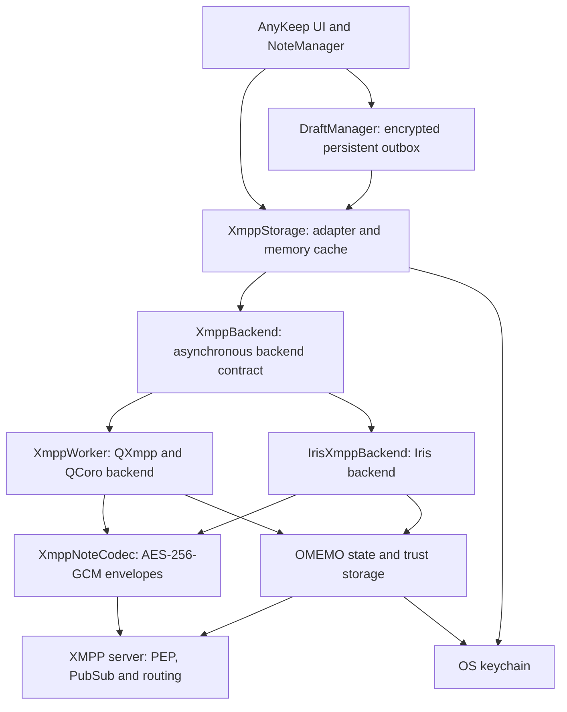
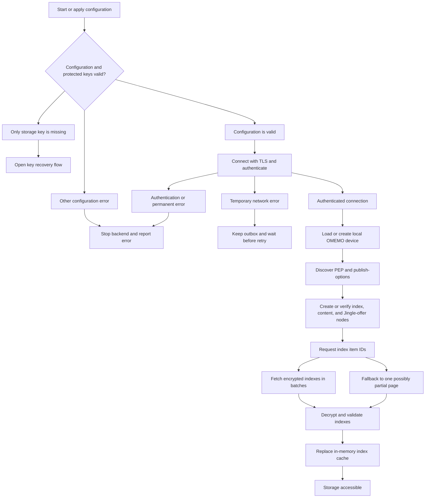
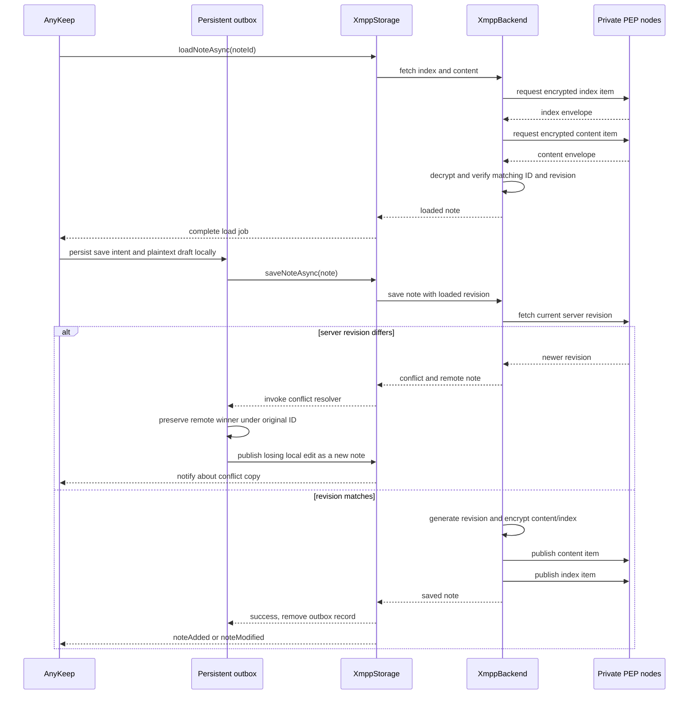
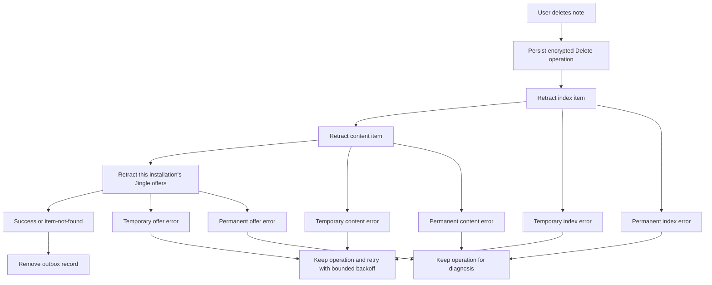
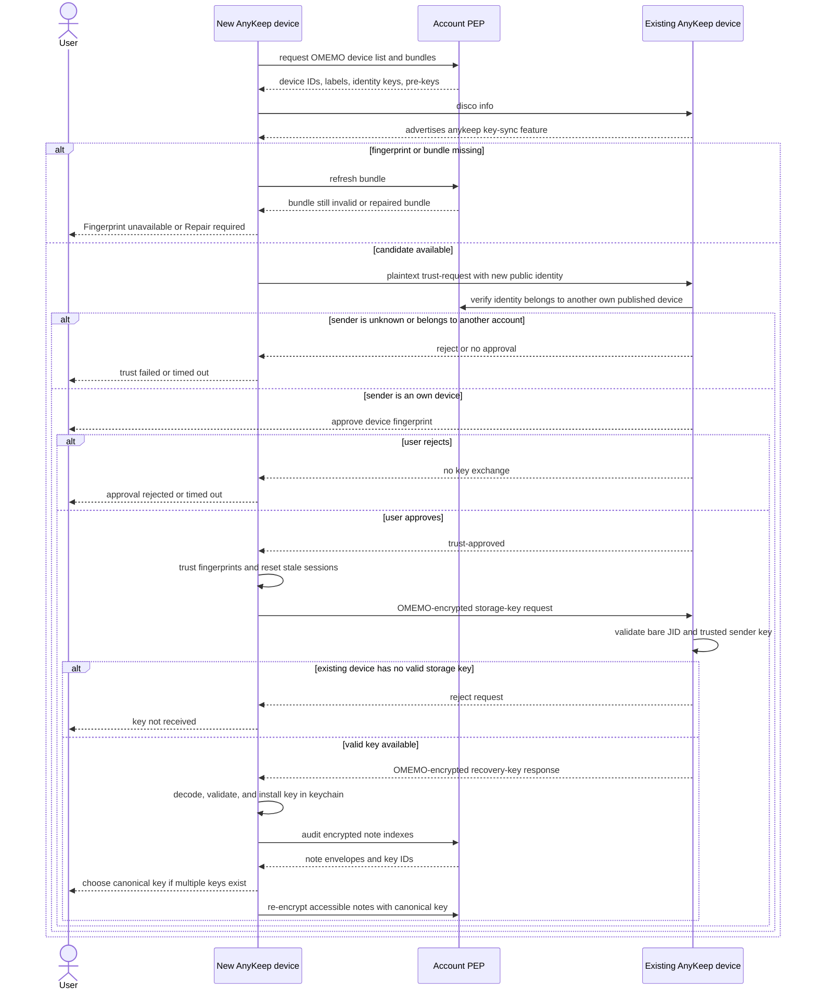
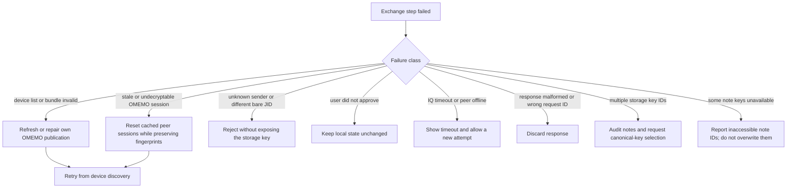

# XMPP Private Notes plugin

`xmpppubsub` is an encrypted AnyKeep storage backend. It synchronizes Markdown
notes between AnyKeep installations through the user's XMPP account using
private persistent PEP nodes.

The implemented wire protocol is documented separately in
[Private Encrypted Notes over XMPP](PROTOXEP.md). That document is a ProtoXEP
and implementation specification, not an XSF-assigned XEP. Cross-language
encoder/decoder instructions, fixed vectors and the Rust smoke test are in the
[interoperability guide](INTEROPERABILITY.md).

The cross-storage attachment model is documented in
[Media storage architecture](../../docs/media-storage-architecture.md). The Iris
backend implements the XMPP mapping with XEP-0447/XEP-0448,
XEP-0358/XEP-0234 direct Jingle sources, and optional XEP-0363 HTTP sources.

The XMPP server stores encrypted note records and routes synchronization
events. Note plaintext and the AnyKeep storage master key are not published to
PEP. OMEMO is used to authenticate the user's AnyKeep devices and to transport
the storage key during device onboarding.

## Capabilities

- creates and verifies private persistent PEP nodes;
- stores the encrypted note index and content in separate nodes;
- lists notes in batches using backend-specific item-ID discovery with a direct PubSub fallback;
- creates, loads, updates, and retracts notes asynchronously;
- publishes encrypted media attachments through a persistent private catalog
  of direct Jingle offers, optionally adds an HTTP source, and verifies
  ciphertext and plaintext hashes when receiving them;
- restores Jingle serving capabilities from an encrypted local cache, but
  activates them only after their exact PubSub items have been verified;
- propagates publish, retract, purge, and node invalidation events;
- detects optimistic revision conflicts before publishing an update;
- keeps note publication and deletion operations in an encrypted persistent
  outbox and retries transient failures with exponential backoff;
- discovers the account's OMEMO devices and displays their fingerprints;
- repairs incomplete own-device OMEMO bundles produced after pre-key use;
- establishes trust between two own AnyKeep devices and transfers the storage
  key over an OMEMO-protected IQ;
- audits notes encrypted with different storage keys and can re-encrypt them
  with a selected canonical key;
- requires TLS and does not ignore certificate errors.

## Building

The plugin is available on Linux/Unix, macOS, and Windows. The XMPP
implementation is selected at configure time with `ANYKEEP_XMPP_BACKEND`:

- `QXMPP` (default) requires QXmpp 1.11 or newer, its matching OMEMO library,
  and QCoro Core for the selected Qt major version;
- `IRIS` prefers an installed Iris CMake package exposing `Iris::Iris`. If no
  suitable system package exists, `ANYKEEP_BUILD_BUNDLED_IRIS=ON` enables the
  pinned FetchContent fallback. The fallback is enabled by default on Android,
  Windows, and macOS and disabled by default on Linux/Unix. When QCA itself is
  bundled, AnyKeep deliberately does not use a system Iris so both AnyKeep and
  Iris consume the same bundled QCA runtime.

Both backends require Qt Network and Qt XML. Configure the default QXmpp build
normally:

```sh
cmake -S . -B build
cmake --build build
```

Select Iris explicitly:

```sh
cmake -S . -B build-iris -DANYKEEP_XMPP_BACKEND=IRIS
cmake --build build-iris
```

The bundled Iris build uses AnyKeep's source-controlled upstream commit pin;
`ANYKEEP_IRIS_GIT_TAG` can override that revision. For Iris development, point
AnyKeep at a local checkout instead; `ANYKEEP_IRIS_SOURCE_DIR` explicitly
overrides an installed Iris:

```sh
cmake -S . -B build-iris \
  -DANYKEEP_XMPP_BACKEND=IRIS \
  -DANYKEEP_IRIS_SOURCE_DIR=/path/to/iris
```

A local checkout is never modified by AnyKeep; it is built as-is.

Disable it explicitly when building without the XMPP dependencies:

```sh
cmake -S . -B build -DANYKEEP_PLUGIN_ENABLE_xmpppubsub=OFF
```

The CMake cache option is named `ANYKEEP_PLUGIN_ENABLE_xmpppubsub`. Dependency
detection controls its default value. Explicitly forcing it to `ON` while a
required package is unavailable produces a normal CMake target/dependency
error.

On Debian/Ubuntu the Qt 6 build uses, among the usual Qt development packages,
`libqxmppqt6-dev` (including the matching OMEMO CMake target) and
`qcoro-qt6-dev`. Package names may differ in other releases and distributions.

## Configuration

Open AnyKeep's plugin settings and configure **XMPP Private Notes**:

1. enter the bare JID and password;
2. optionally override the host and port;
3. keep a distinct resource for every installation (AnyKeep generates one from
   a stable installation UUID);
4. create/import a storage key, or obtain it from another trusted AnyKeep device;
5. apply the configuration and inspect the OMEMO device list.

The default base node is `urn:xmpp:private-notes:0`; the final `0` identifies
the initial experimental protocol version. It expands to:

- `urn:xmpp:private-notes:0:index` — encrypted title, tags, optional folder
  path, timestamp, format, index revision, parent revision, and origin;
- `urn:xmpp:private-notes:0:content` — encrypted note body bound to the same
  note ID and content revision. Folder changes and manual reordering publish a
  fresh index while keeping the existing body revision through a required
  encrypted extension, so they do not upload the body again;
- `urn:xmpp:private-notes:0:jinglepub` — private persistent XEP-0358 offers
  for attachment ciphertext held by individual AnyKeep installations.

The same namespace is used by the outer encrypted element and authenticated
plaintext. There are no separate `wire`, `schema`, or minor-version fields. Compatible optional
extensions use their own XML namespaces; incompatible changes use a new major
namespace and new nodes.

All three nodes must be persistent, payload-delivering, and allowlist-only. The
plugin refuses to use a server that does not advertise a PEP identity and
PubSub `publish-options`.

## Architecture

The storage-facing code does not depend directly on QXmpp or Iris. `XmppBackend`
is the asynchronous boundary implemented by both `XmppWorker` (QXmpp) and
`IrisXmppBackend` (Iris). The selected backend is created by
`XmppBackendFactory`; storage, retry, recovery, and UI code use the same
contract in either build.

Arguments of asynchronous backend methods are passed by value deliberately.
An implementation owns the request data after the call returns and may safely
retain it across coroutine suspension or queued callbacks. Implementations
must not replace those values with reference parameters: the caller's stack
frame is not part of the asynchronous lifetime.



### Component responsibilities

| Component | Responsibility |
| --- | --- |
| `XmppStorage` | AnyKeep `NoteStorage` adapter, configuration, in-memory cache, job completion, UI-facing errors |
| `XmppBackend` | backend-neutral asynchronous CRUD, lifecycle, OMEMO, audit, and key-sync contract |
| `XmppWorker` | QXmpp implementation; connection, PEP, PubSub, OMEMO, and QCoro flows |
| `IrisXmppBackend` | Iris implementation of the same lifecycle, PEP/PubSub, OMEMO, audit, key-sync, and media-transfer contract |
| `IrisJinglePublicationProvider` | encrypted local Jingle capability cache and bridge to Iris's authoritative XEP-0358 publication manager |
| `XmppPepExtension` | incoming PubSub event filtering and conversion to backend signals |
| `XmppKeySyncExtension` | `urn:xmpp:private-notes:key-sync:0` IQ parsing, request tracking, and replies |
| `XmppNoteCodec` | encryption/decryption and binding index/content records to the PubSub node and item ID |
| `XmppOmemoStorage` | encrypted persistence of local OMEMO identity, sessions, and pre-keys |
| `XmppPersistentTrustStorage` | persistent OMEMO trust decisions |
| `XmppKeyResolutionController` | UI-neutral device trust, key audit, canonical-key choice, and recovery state |
| `XmppDialogPresenter` | presents the shared QML recovery and trust flows in an active or standalone Qt Quick window |
| `DraftManager` | durable publish/delete intent, retry scheduling, and recovery after restart |

Both backends run in Qt's normal event loop. There is no dedicated XMPP thread
and no nested `QEventLoop`; the QXmpp implementation uses QCoro while the Iris
implementation composes Iris tasks and encryption jobs with queued callbacks.
XMPP is primarily I/O-bound, so a second thread is not useful here. Expensive
CPU work can be isolated later without changing the backend contract.

Concurrent storage requests share a single backend preparation attempt. Login,
OMEMO loading, PEP discovery, and node verification therefore run once even
when several load/save jobs arrive while the account is connecting. Reconnect
backoff belongs to `XmppStorage`; QXmpp's independent automatic reconnect loop
is disabled so permanent and transient errors cannot start competing retries.
Backend shutdown is terminal until an explicit `start()`; merely assigning a
configuration cannot revive stale work queued before plugin shutdown.

## Connection and initial synchronization



Incoming index publication events update or invalidate the cache. Reconnect,
purge, and node deletion trigger a full refresh rather than assuming that the
event stream is complete.

Connection failures are classified by the backend. Authentication, TLS,
configuration, and protocol failures stop automatic reconnect until the user
changes the configuration. Socket failures, timeouts, temporary stream errors,
and retryable stanza errors keep local/outbox state intact and retry after 30,
60, 120, 240, and then 300 seconds. On Qt 6.4 or newer, a system reachability
change to an available network triggers an immediate attempt instead of waiting
for the current delay to expire.

## Note synchronization

### Load and save



Conflict detection is optimistic, not atomic compare-and-swap: XEP-0060 has no
`If-Match` equivalent. A narrow race remains between checking the server
revision and publishing. `parentRevision` and `originId` preserve enough
information to detect sibling revisions published from the same parent. When a
PEP event displaces a sibling revision authored by this installation, the same
resolver is invoked. Other installations converge on the server winner without
creating duplicate copies.

Conflict handling is policy-based through `ConflictResolver`. The default
`CopyConflictResolver` is lossless: it retains the visible remote version under
the original ID, gives the losing local draft a new ID, publishes it as
`<title> (conflict <local time>)`, and notifies the user. Alternative policies
can keep the durable draft for an interactive decision, explicitly discard it,
or later implement a merge UI.

Publishing content and index is also not a server-side transaction. Content is
published first and index second so readers never observe a new index pointing
at content that has not been uploaded. A failure between the two publications
leaves an unreferenced content revision; the durable outbox preserves the local
draft for retry. During a successful publication another reader can briefly
observe the old index with the new content. AnyKeep recognizes this revision
mismatch as a transient inconsistent snapshot and repeats the complete
index-plus-content read before making a conflict decision.

### Delete

Deletion is also durable. AnyKeep first writes a `Delete` record to the encrypted
outbox, then retracts the index, content, and this installation's attachment
offer items asynchronously. Successful or already-missing items complete the
operation. Retracting the index first makes the note disappear promptly;
removing offers last avoids making its media unavailable before the note itself
is gone. A temporary error retains the record and retries with a delay capped
at five minutes.



## Storage-key exchange between own devices

The storage master key and the OMEMO identity key are different things:

- the random storage master key encrypts AnyKeep index/content envelopes;
- OMEMO device identities authenticate installations and protect the IQ that
  transports the encoded storage recovery key;
- trust is limited to devices published by the same bare JID and still requires
  explicit user approval when it cannot be established safely.

The first plaintext `trust-request` contains no storage key. It bootstraps trust
by presenting the new device's public OMEMO identity. The actual key request and
response are sent only after trust approval and are OMEMO encrypted.



### Error handling during key exchange



An incomplete OMEMO bundle is never accepted as a fingerprint. Repair only
restores the local device's publication when the server bundle has an empty
identity key and a previously cached bundle proves the expected identity. A
non-empty mismatching identity is not overwritten automatically.

## Encryption and privacy boundary

AnyKeep uses AES-256-GCM application-level envelopes. Associated data binds an
envelope to its key domain, PubSub node, and item ID. The index
and content payloads additionally cross-check note ID and revision.

The server can still observe:

- the account and connected resources;
- PEP node names and item UUIDs;
- full resource JIDs of Jingle providers, ciphertext sizes and hashes, update
  timing, and deletion timing;
- OMEMO device IDs, labels, and public bundles.

It cannot derive note titles, bodies, tags, formats, revisions, or timestamps
from the encrypted AnyKeep payload without the storage master key.

Local drafts, pending deletions, Jingle serving capabilities, the storage key,
and OMEMO state are also protected at rest. The storage key and state-wrapping
key are kept in the platform keychain; encrypted draft/outbox, Jingle
capability, and OMEMO state files live in the AnyKeep data directory.

## Iris integration

`IrisXmppBackend` implements the same AnyKeep-facing contract as `XmppWorker`:
connection lifecycle and error classification, PEP discovery/configuration,
PubSub events and note CRUD, OMEMO device/trust maintenance, storage-key audit,
and encrypted key-sync IQs. Iris OMEMO and trust state use separate encrypted
state files so switching builds never asks one backend to deserialize the
other backend's session format.

AnyKeep consumes Iris only through its canonical `Iris::Iris` CMake target,
whether Iris comes from a system package or the pinned FetchContent fallback.
The Iris backend uses the QCA generation selected by AnyKeep; bundled Iris never
builds a second QCA copy. No private-notes wire format depends on how Iris is
provided.

The Iris backend uses `Jingle::PublicationManager` for XEP-0358 authority and
request queuing. `IrisJinglePublicationProvider` registers before connection,
restores encrypted local factories as unverified, and lets Iris activate them
only after targeted PubSub verification. Incoming `<start/>` requests that
arrive during synchronization remain queued. A retract, purge, confirmed
absence, or failed exact comparison disables serving and never triggers an
automatic republish. After downloading and verifying an attachment from
another installation, AnyKeep publishes its own independently addressable
offer for the same ciphertext.

## Current limitations

- the XMPP password is stored in the platform keychain (with Psi's `xmpp`
  service used as an import source); `QSettings` remains a compatibility
  fallback on systems where no usable keychain is available;
- the note cache is in memory; the durable outbox protects local edits and
  deletions, but a cold start still refreshes indexes from PEP;
- the default resolver creates a lossless conflict copy; there is no automatic
  merge UI or remote revision history;
- PubSub does not provide an atomic transaction across revision check, content
  publication, and index publication;
- backend selection is currently a build-time choice; one binary does not switch
  between QXmpp and Iris at runtime;
- direct Jingle media publication is currently implemented only by the Iris
  backend; the QXmpp backend still needs an equivalent publication provider;
- if an installation is offline for the entire lifetime of a note-deletion
  event, cleanup of that installation's now-orphaned offers requires an
  explicit authoritative reconciliation path; a possibly partial PubSub page
  is deliberately never treated as a deletion list;
- servers that reject item-ID discovery fall back to one page, which may be
  partial when the server does not expose a usable continuation API.

## Suggested validation matrix

1. New account: create nodes, save, restart, load, edit, and delete.
2. Two online resources: verify publish/retract events in both directions.
3. Conflict: load one revision on two devices and save both independently.
4. Offline save/delete: restart before reconnecting and verify outbox recovery.
5. Fresh device: clear one installation and complete trust plus key transfer.
6. Rejected trust: verify no encrypted storage key is sent.
7. Broken/missing own bundle: verify Repair restores only the expected identity.
8. Different storage keys: audit, choose canonical key, and re-encrypt notes.
9. Missing historical key: verify inaccessible notes are reported and preserved.
10. Server without item-ID discovery: verify partial-page warning behavior.
11. No HTTP Upload service: save and load media through Jingle only.
12. Restart a provider: send `<start/>` before and after targeted PubSub
    verification and confirm that the early request waits.
13. Retract an offer from another own device and verify that the local cache
    neither serves nor republishes it.
14. Download on a second installation, take the original provider offline, and
    verify that the second installation's offer can still serve the ciphertext.
